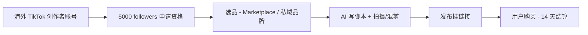

# TikTok Shop Affiliate Creator(中国个人 2026)

## 一句话定位

中国个人用海外(美/英)身份注册 TikTok 创作者账号 + 5000 followers,通过 TikTok Shop Affiliate 平台挂商品链接做短视频带货,获得 GMV 10-50% 销售佣金;US TikTok Shop 2026 GMV $23.4B(同比近翻倍),转化率 4.7% 是 Amazon 2 倍以上。

## 自动化路径

工具栈:
- **TikTok Seller/Creator Center**:用于注册 Affiliate 资格 + 选品 + 挂链接
- **Capcut / Premiere Pro**:用于视频剪辑(可 AI 提效)
- **Minea / Peekster / Shoplus**:用于选品和趋势分析(可自动化脚本监控)
- **OpenAI / Claude**:用于写脚本/产品描述/SEO caption
- **n8n / Make / Zapier**:用于自动发布 + 监控数据
- **TikTok Shop Affiliate Marketplace**:直接对接 1000+ 品牌商品

关键步骤:

| # | 步骤 | 自动/人工 | 工具 |
| --- | --- | --- | --- |
| 1 | 注册美/英 TikTok 创作者账号 | 人工(首次) | 需海外身份(US/UK/CA) |
| 2 | 养号到 5000 followers | 人工 + 半自动(发布工具) | 平台 |
| 3 | 申请 TikTok Shop Affiliate 资格 | 自动 | TikTok 平台 |
| 4 | 选品(从 Marketplace 挑选高佣商品) | 半自动 | Minea + Shoplus + AI |
| 5 | 短视频内容生产 | 人工(关键环节) | Capcut + AI 脚本 |
| 6 | 发布 + 挂 affiliate 链接 | 自动 | TikTok 创作者后台 |
| 7 | 监控 + 优化 | 半自动 | 自建 dashboard |

`auto_ratio`: 0.65(选品/数据/发布可自动化,但内容创作核心是人工)

## 评分明细(按 002 标准)

| 维度 | 分数(0-10) | v2 权重 | 加权 |
| --- | --- | --- | --- |
| 启动成本(资金) | 9(0 启动,只需一部手机) | 0.15 | 1.35 |
| 启动成本(技能) | 5(短视频内容创作 + 选品能力) | 0.05 | 0.25 |
| 首笔收入速度 | 7(养号 2-4 周 + 上线即可挂链接) | 0.15 | 1.05 |
| 可扩展性 | 9(可同时挂多个品,边际成本低) | 0.10 | 0.90 |
| 可持续性 | 7(TikTok 平台仍高速增长) | 0.10 | 0.70 |
| 自动化程度 | 6(选品/发布可自动,内容创作核心人工) | 0.15 | 0.90 |
| 风险 | 4.4(拆分:法律 4 × 0.5 + ToS 4 × 0.3 + 市场 6 × 0.2 = 4.4) | 0.15 | 0.66 |
| 证据强度 | 7(ShortFormNation 2026 完整报告) | 0.15 | 1.05 |
| + 现实数据奖励 | +0.5(88% TikTok Shop GMV 来自 affiliate creators,$23.4B US GMV) | — | +0.50 |
| **总分** | — | — | **7.3** |

调整说明:内容创作是核心人工环节,自动化维度下调;中国个人身份限制风险维度仍保持 5。

决策:**排队**(两周内启动,先养号到 5000 followers)

## 启动清单

- [ ] 注册美/英 TikTok 创作者账号(需海外手机号/邮箱 + VPN)
- [ ] 选定 niche(美妆/家居/3C/母婴等)和账号定位
- [ ] 养号到 5000 followers(2-4 周,持续发垂直内容)
- [ ] 申请 TikTok Shop Affiliate 资格(需 SSN/EIN 验证)
- [ ] 在 Marketplace 选 5-10 个高佣商品研究
- [ ] 产出 5-10 条带货短视频(挂 affiliate 链接)
- [ ] 测试数据 + 优化选品和内容方向
- [ ] 收款:Payoneer / US 银行账户 → 国内
- [ ] 监控:GMV、佣金率、CTR、转化率

## 风险与红线

- **中国个人无海外身份**:必须用 US/UK TikTok 账号 + 海外手机号 + VPN。**严格说违反 TikTok ToS**(平台要求"实际居住地"),灰度风险登记。已存在大量案例。
- **平台政策不稳定**:TikTok 美国业务受 2024-2025 美国国会法案影响(2025 法案后 Trump 表示不强制出售),**但任何政策变动都可能影响美国区业务**(Banned/Restrict)。 持续监控:ByteDance/Trump 谈判进展。
- **5000 followers 门槛**:需 2-4 周垂直内容输出,且需有商业化意愿(纯兴趣号难达)。
- **TikTok 创作者付费提现门槛**:满 $10 才可提现,需 Payoneer/US 银行账户。
- **内容合规**:不得侵犯品牌/影视/名人 IP,广告披露必须做(#ad / #TikTokShopPartner)。
- **数据真实性**:不得刷粉丝/刷量,TikTok 算法对异常账号会限流或封号。
- **类目限制**:医疗/金融/成人/赌博等类目禁止带货。

## 监控指标

- 指标 1:**TikTok Shop 月度 GMV** — 目标 30 天 $500,90 天 $3000,180 天 $10000
- 指标 2:**平均佣金率** — 目标 ≥15%(Targeted Collaboration 可达 25-50%)
- 指标 3:**视频平均转化率** — 目标 ≥2-3%(Open Collab 基准 2-4%,Targeted 8-12%)
- 指标 4:**粉丝增长** — 月增 1000-3000 followers,6 个月内到 1 万

## 参考来源

1. [TikTok Shop Affiliate Marketing: The Complete 2026 Guide - ShortFormNation](https://www.shortformnation.com/blog/tiktok-shop-affiliate-marketing-the-complete-2026-guide) — 类型:media(数据驱动深度报告) — 抓取:2026-06-04
   > "TikTok Shop hit $23.4 billion in US GMV and is nearly doubling year-over-year... conversion rates sit at 4.7% on average — versus 2-4% on traditional e-commerce... 88% 来自 affiliate creators"
2. [TikTok Seller University - Affiliate 文档](https://seller-us.tiktok.com/university/essay?knowledge_id=6939143037667118&lang=en) — 类型:official — 抓取:2026-06-04
   > Open Collaboration 要求 5,000 followers(US);佣金 10-15% 基准,Targeted Collaboration 可达 25-50%
3. [New TikTok shop policy: easier time registering - LinkTrans 2024-11](https://en.link-trans.com/new-tiktok-shop-policy-you-will-have-an-easier-time-registering-for-tiktokshop/) — 类型:media — 抓取:2026-06-04
   > "Chinese sellers can now easily open a TikTok US cross-border shop with a valid mainland China or Hong Kong business license and local warehousing capacity in the US" (注意:这是 Seller 入驻政策,不是 Creator Affiliate)
4. [TikTok Shop 跨境官方 - douyinec.com](https://douyinec.com/) — 类型:official — 抓取:2026-06-04
   > "跨境商家"入口 b.guantou.com — 中国卖家开 TikTok Shop 卖家需要大陆/香港营业执照 + 美国海外仓
5. [TikTok 创作者中心 - notanothercoach video 7617183286468611359](https://www.tiktok.com/@notanothercoach/video/7617183286468611359) — 类型:community — 抓取:2026-06-04
   > 创作者实际案例

## 复盘/亲测

> 仅在亲自执行后填写。
