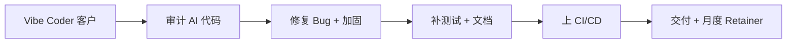

# Vibe Coding Cleanup Service(AI 代码清理/重构成生产级)

## 一句话定位

面向「用 Cursor / Bolt / Lovable / v0 / Replit Agent 等 vibe coding 工具产出了 AI 原型代码,但不敢上生产」的初创团队与中小企业,提供「AI 代码审计 + 重构 + 加固 + 测试 + CI/CD + 文档」一站式服务,按项目 $3,000-30,000 报价或月费 $2K-5K Retainer,平台主推 Upwork Fiverr + 独立站点,收款 Stripe / PayPal / Payoneer。

## 自动化路径

工具栈:
- Cursor / Claude Code / Aider(自己用 AI 提效)
- Sentry / SonarQube / Semgrep(代码审计与安全扫描)
- GitHub Actions / Vercel(部署与 CI/CD)
- Linear / Notion(项目管理)
- Stripe / Wise(收款)
- Loom(交付演示)

| # | 步骤 | 自动/人工 | 工具 |
| --- | --- | --- | --- |
| 1 | 接触目标客户(Upwork 搜"vibe coding"、X 搜"my AI app crashed") | 半自动 | LinkedIn, Upwork Alerts |
| 2 | 审计代码(SonarQube + Semgrep + Sentry) | 自动 | SonarQube, Semgrep |
| 3 | 重构与加固(security, error handling, modularization) | 半自动 | Cursor + Claude Code |
| 4 | 补单元/E2E 测试 | 半自动 | Playwright, Vitest |
| 5 | CI/CD 搭建(GitHub Actions / Vercel) | 自动 | GitHub Actions |
| 6 | 文档(Onboarding, Architecture diagram) | 半自动 | Cursor + Mintlify |
| 7 | 月度 Retainer 维护 | 半自动 | Linear + GitHub |

`auto_ratio`: **0.65**(核心是工程判断,AI 工具辅助,无法完全自动化)

## 评分明细(按 002 标准)

| 维度 | 分数(0-10) | v2 权重 | 加权 |
| --- | --- | --- | --- |
| 启动成本(资金) | 9(0 启动) | 0.15 | 1.35 |
| 启动成本(技能) | 4(需 5+ 年工程经验) | 0.05 | 0.20 |
| 首笔收入速度 | 5(1-4 周:接 Upwork + 第一个客户案例) | 0.15 | 0.75 |
| 可扩展性 | 7(高客单价,可产品化为月度 Retainer) | 0.10 | 0.70 |
| 可持续性 | 9(Gartner 75% 企业工程师 2028 用 AI 编码助手) | 0.10 | 0.90 |
| 自动化程度 | 5(核心是工程判断,AI 只能辅助) | 0.15 | 0.75 |
| 风险 | 8.7(拆分:法律 10 × 0.5 + ToS 9 × 0.3 + 市场 5 × 0.2 = 8.7) | 0.15 | 1.31 |
| 证据强度 | 6(新兴 niche,缺大量独立案例) | 0.15 | 0.90 |
| + 现实数据奖励 | 0(Mitrix/HatchWorks 报告无具体月入数字) | — | 0.00 |
| **总分** | — | — | **6.9** |

决策:**排队(两周内启动)**

## 启动清单

- [ ] 注册 Upwork + Fiverr"AI Code Cleanup / Refactor" Gig
- [ ] 准备 1 份可公开的 cleanup 案例(找一个开源 vibe-coded 项目,跑一遍流程并截图对比)
- [ ] 准备 Loom 介绍视频(2 分钟,展示从"坏味道"到"生产级"的过程)
- [ ] 建独立站点:vibe-cleanup.com 类(可选,Gumroad 上卖"AI 代码审计 checklist $39"做漏斗)
- [ ] 定价:首单 $3K-5K(可打折换评价),老客户 $5K-30K 项目
- [ ] Stripe + Payoneer 收款
- [ ] 准备 Semgrep/SonarQube/Cursor 工作流模板,提高交付效率

## 风险与红线

- **技能门槛高**:必须有真实工程经验,新人无法快速入行(降低"启动成本技能"评分)。
- **服务非标性高**:每个 AI 项目代码质量差异大,需先做 1-2 周"诊断-报价"流程,避免误接烂尾单。
- **客户期望管理**:客户期望"用 vibe coding 应该很快",需在售前明确"清理是工程活,不是 prompt 活"。
- **不做"prompt 注入绕过 ToS"等黑产**:坚守合法服务边界。
- **不接被平台列入黑名单的代码(爬虫、灰产)**。

## 监控指标

- 每月 Upwork/Fiverr 主动 proposal 数(健康线 > 30)
- 每月成交 Cleanup 单数(健康线 > 2)
- 单项目平均客单价(健康线 > $5K)
- 月度 Retainer 续费率(健康线 > 80%)
- 公开案例数(健康线 > 5 个,可显著降低获客成本)

## 参考来源

1. [Mitrix Blog - How vibe coding cleanup specialists turn AI prototypes into products (2026)](https://mitrix.io/blog/how-vibe-coding-cleanup-specialists-turn-ai-prototypes-into-products/) — authoritative-media — 抓取:2026-06-04
   > "A vibe coding cleanup specialist is a developer who takes AI-generated prototype code and turns it into production-ready software by fixing structural issues, security gaps, and adding test coverage."
2. [HatchWorks - The Real Cost of Vibe Coding in 2026 (April 2026)](https://hatchworks.com/blog/gendd/cost-of-vibe-coding/) — authoritative-media — 抓取:2026-06-04
   > "Vibe coding tools want you to think the cost is $20 a month... the real cost is the security vulnerabilities baked into AI-generated code that no one reviewed."
3. [Upwork - Vibe Coding Developers for Hire (Jun 2026)](https://www.upwork.com/hire/vibe-coding-developers/) — official — 抓取:2026-06-04
   > "Hire top-rated freelance Vibe Coding developers on Upwork. Post your job and get personalized bids, or browse for talent ready to work on your vibe project."
4. [Reddit r/VibeCodeDevs - I tried every AI vibecoding platform in 2026](https://www.reddit.com/r/VibeCodeDevs/comments/1qw6k54/i_tried_every_ai_vibecoding_platform_in_2026/) — community — 抓取:2026-06-04
   > 多个 vibe coder 公开抱怨"原型能用,生产不行",印证 cleanup 服务需求。

## 复盘/亲测

> 未亲测。适合有 5+ 年工程经验、能用 AI 提效 3-5 倍的人。门槛高但护城河高。
