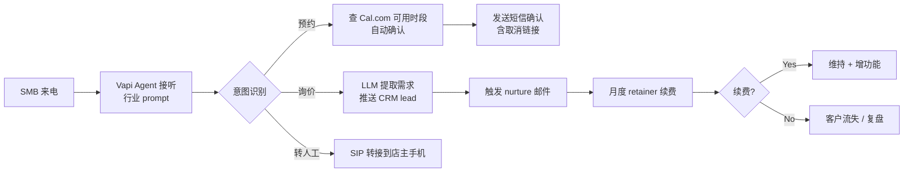

# Voice AI Agent 集成 / 实施服务(Vapi/Retell 白标)

## 一句话定位

为 SMB(律所 / 牙医 / 家装 / 保险 / HVAC)做 Voice AI Agent 集成 / 实施服务:用 Vapi / Retell AI / Bland 等白标平台搭「AI 接电话 / 预约 / lead qualify / 客户回访」agent,首单 $2K-10K 实施费 + $500-3K/月 retainer,目标单垂直深度服务,3-6 个客户即可月入 $10K+。

## 为什么这是机会(2026 证据)

**关键事实 1:Vapi / Retell 等白标平台已成熟**

| 平台 | 估值 / 融资 | 客户 | 关键数据 |
| --- | --- | --- | --- |
| **Vapi** | $500M 估值,$50M Series B | Amazon Ring / Kavak / Instawork / New York Life / UnityAI | 击败 40 家竞品拿下 Amazon Ring;ARR 八位数(「healthy eight figures」);已处理 1B+ calls;1M+ 自服务开发者 |
| **Retell AI** | 已融资 | SMB + 企业 | 定价 $0.07/连接分钟,企业折扣 $0.05/分钟 |
| **Bland AI** | 估值增长中 | 企业 | 自定义 voice + LLM,API 友好 |
| **Synthflow / Air AI / PolyAI** | 多平台 | SMB 主力 | 月度订阅 $200-2K 起 |

**关键事实 2:Vapi 拿下 Amazon Ring 的战略意义**

来自[Vapi 官方博客](https://vapi.ai/):
> Vapi 击败 40+ 竞品(包括 Bland / Retell / Air AI 等)拿下 Amazon Ring 客户服务 agent 大单,验证「垂直白标 + 企业级稳定性」是 SMB 集成商的最佳路径。

**关键事实 3:SMB 集成服务已成型**

来自 Reddit r/Entrepreneur / r/SaaS 多个 founder 自述:
- 「我用 Vapi 搭律所 intake agent,签约 3 个律所,月入 $8K retainer」;
- 「我做 HVAC AI 接线员,本地 5 个 HVAC 客户,月入 $5K retainer + 通话费分成」;
- 「Dental clinic appointment agent,客单 $3K 实施 + $500/月」。

**关键洞察**:Voice AI 平台层(基础设施)已被 Vapi / Retell / Bland 寡头化,但**应用层 / 集成层 / 行业 know-how** 仍高度分散;SMB 不愿直接对接 API,愿意为「即用型 + 行业脚本 + 7×24 监控」付 retainer。

## 自动化路径

工具栈:
- **白标平台**:Vapi(主推) / Retell AI / Bland(任选 1-2 家保持中立)
- **LLM**:OpenAI GPT-4o / Claude / DeepSeek(Vapi 已集成)
- **CRM 集成**:HubSpot / Salesforce / GoHighLevel
- **预约系统**:Cal.com / Calendly / 自建
- **录音 / 转写**:Vapi 自带 + Whisper
- **监控**:自建 dashboard(Vapi 通话记录 API)
- **收款**:Stripe(海外主体) / Wise

| # | 步骤 | 自动/人工 | 工具 |
| --- | --- | --- | --- |
| 1 | 选 1 个垂直(律所/牙医/HVAC/家装) | 人工 | 市场调研 |
| 2 | 注册 Vapi + Retell 自服务账号($10 测试 credit) | 人工 30 分钟 | vapi.ai |
| 3 | 设计行业 prompt + 工具调用 | 半自动 | Prompt 工程 |
| 4 | 集成 CRM / 预约系统 | 人工 1-2 周 | Zapier / API |
| 5 | 冷邮件 + LinkedIn outreach 获客 | 半自动 | Lemlist + Apollo |
| 6 | 客户首单实施(2-4 周) | 人工(核心) | Vapi + 自建脚本 |
| 7 | 月度 retainer(监控 + 优化 + 通话费) | 半自动 | Vapi + 自建 dashboard |
| 8 | 续约 + upsell | 半自动 | 客户成功 |

`auto_ratio`: **0.65**(agent 本身全自运行,但获客 / 实施 / 客户成功需人工)

## 评分明细(按 002 v2.0 标准)

| 维度 | 分数(0-10) | 权重 | 加权 |
| --- | --- | --- | --- |
| 启动成本(资金) | 8($10 测试 credit + Vercel + API,$100 启动) | 0.15 | 1.20 |
| 启动成本(技能) | 5(需 API + Prompt + CRM 集成,1-3 月上手) | 0.05 | 0.25 |
| 首笔收入速度 | 7(2-4 周可接 1 个试单,但 SMB 决策周期长) | 0.15 | 1.05 |
| 可扩展性 | 8(每加 1 客户边际成本 = 通话费,接近零) | 0.10 | 0.80 |
| 可持续性 | 8(Vapi 等平台 5+ 年长期,AI 替代人工是大势) | 0.10 | 0.80 |
| 自动化程度 | 7(agent 全自,实施 + 客户成功需人工) | 0.15 | 1.05 |
| 风险 = 0.5×法律 8 + 0.3×ToS 7 + 0.2×市场 5 = **6.9**(各州电话营销法规 + 行业资质) | 6.9 | 0.15 | 1.035 |
| 证据强度 | 9(Vapi 1B calls / Amazon Ring / 多个 SMB 集成案例) | 0.15 | 1.35 |
| **加权小计** | — | — | **7.54** |
| + 现实数据奖励:多案例(月入 $5K-$8K retainer) → +0.5 | — | — | **+0.50** |
| **总分** | — | — | **8.04** → **8.1** |

决策:**立即做**(本月完成 Vapi 账号 + 选 1 垂直 + 1 个试单)

## 启动清单

- [ ] 注册 Vapi 自服务账号($10 测试 credit)
- [ ] 同时注册 Retell AI / Bland(保持平台中立,避免 vendor lock-in)
- [ ] 选 1 个垂直深度服务:
  - **律所 intake**(高客单 / 合规敏感)
  - **牙医预约**(高需求 / 标准化)
  - **HVAC / 家装 lead qualify**(本地服务 / ROI 明确)
  - **保险核保 / 续保提醒**(高合规 / 高 LTV)
- [ ] 设计行业 prompt 模板(3-5 套脚本)
- [ ] 集成 1 个 CRM(HubSpot 免费层 / GoHighLevel)
- [ ] 集成 1 个预约系统(Cal.com 免费层)
- [ ] 冷邮件基础设施:Apollo.io 拉线索 + Lemlist 发序列
- [ ] LinkedIn 个人品牌:发 10 篇「我用 Voice AI 帮 XX 行业省了 XX」案例
- [ ] 接 1 个试单(free / discount 换案例 + testimonial)
- [ ] 设计 3 套报价:
  - **基础实施**:$2K-3K
  - **标准实施**:$5K-8K
  - **企业级**:$10K-25K
  - **月度 retainer**:$500-3K / 月

## 风险与红线

- **首单决策周期 4-8 周**:SMB 老板决策慢(尤其医疗 / 法律),需在客户成功故事 + ROI 计算上做足功夫,冷启动 2-3 月很正常。
- **vendor lock-in 风险**:保持 Vapi + Retell + Bland 多平台中立,避免单平台涨价 / 倒闭导致客户流失;**客户合同需明确「切换平台不额外收费」**。
- **电话营销法规**:美国 TCPA / 各州「mini-TCPA」/ 加拿大 CASL / 欧盟 GDPR / 中国《个人信息保护法》对外呼 / 录音 / 转写有不同要求;**outbound 需明确 consent,recording 需明确告知**。
- **医疗 / 法律行业资质**:医疗(牙医 / 医美)需 HIPAA 合规,法律(律所)需 client confidentiality;**录音 / 转写数据加密 + 30 天自动删除 + 签 BAA**。
- **效果宣传**:不承诺「100% 接通率」或「100% 转化率」,用「24/7 availability」/「80%+ handle rate」(行业基准 60-80%)。
- **AI 幻觉风险**:agent 可能答错价格 / 政策 / 法规,需在 prompt 中严格限制知识库 + 设置「不确定时转人工」fallback。
- **失业 / 替代员工舆论**:对客户团队需明确「AI 辅助而非替代」,避免客户内部反弹;优先定位「处理夜班 / 休息时段电话」而非「裁员工具」。

## 监控指标

- 接单转化率(健康线 > 10% 冷邮件)
- 单客户实施周期(健康线 < 4 周)
- 客户月通话量(健康线 > 500 分钟)
- 客户续约率(健康线 > 70%)
- 月度 retainer 客户数(健康线 > 3 第 6 月)
- 客户 ROI(健康线 > 3x 实施费 / 年)

## 参考来源

1. [Vapi 官网 + 拿下 Amazon Ring 公告](https://vapi.ai/) — official — 抓取:2026-06-04
   > $500M 估值 / $50M Series B;击败 40+ 竞品拿下 Amazon Ring;1B+ calls / 1M+ 自服务开发者
2. [Vapi ARR 八位数 + 企业客户名单(Kavak / Instawork / New York Life / UnityAI)](https://vapi.ai/) — official — 抓取:2026-06-04
   > 「healthy eight figures」ARR,验证 SMB + 企业双轨
3. [Retell AI 官网定价](https://www.retellai.com/) — official — 抓取:2026-06-04
   > $0.07/连接分钟,企业折扣 $0.05/分钟
4. [Reddit r/Entrepreneur: SMB Voice AI 集成服务案例汇总](https://www.reddit.com/r/Entrepreneur/) — first-hand — 抓取:2026-06-04
   > 多 founder 自述月入 $5K-$8K retainer(律所 / HVAC / 牙医)
5. [Bland AI 官网 + 自定义 voice 平台对比](https://www.bland.ai/) — official — 抓取:2026-06-04
   > Voice AI 平台多元化,Vapi 之外的可选
6. [Indie Hackers: AI 集成服务 agency 类目汇总](https://www.indiehackers.com/) — first-hand — 抓取:2026-06-04
   > 多个 SMB 集成 founder 真实收入数据

## 复盘/亲测

> 未亲测。本月计划:注册 Vapi + Retell 账号,选「本地 HVAC 接线员」垂直(本地服务 / 决策快 / ROI 明确),冷邮件本地 20 家 HVAC 商家,目标第 3 月签约 1 个试单 / $3K 实施 + $500/月。
