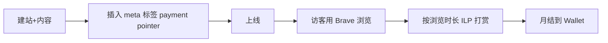

# Web Monetization API 内容付费化

## 一句话定位

用浏览器原生 Web Monetization API(基于 Interledger / ILP),对访客按浏览时长/页面自动微支付(流式打赏),**无需广告、无需弹窗**,把长尾内容/工具站变现。

## 自动化路径

工具栈:
- 一个静态站(Next.js / Hugo)
- Coil / Fynbos 等 Web Monetization 钱包(收款方)
- 访客需用 Brave 浏览器或带 Web Monetization 扩展(付费方)
- Cloudflare Pages 托管(免费)

| # | 步骤 | 自动/人工 | 工具 |
| --- | --- | --- | --- |
| 1 | 建站(任意静态站) | 自动 | Hugo / Next.js |
| 2 | 申请 Web Monetization 钱包 | 半自动 | Coil / Fynbos |
| 3 | 插入 `<meta name="monetization" content="$...">` | 自动 | 一行 |
| 4 | 内容生成(可 AI 流水线) | 自动 | LLM + cron |
| 5 | 监控流量 | 自动 | Plausible / Umami |

`auto_ratio`: **0.9**

## 评分明细(按 002 v2.0 标准)

| 维度 | 分数 | 权重 | 加权 |
| --- | --- | --- | --- |
| 启动成本(资金) | 10(0 资金) | 0.15 | 1.50 |
| 启动成本(技能) | 8(基础 web 即可) | 0.05 | 0.40 |
| 首笔收入速度 | 6(需要 Brave 流量基础) | 0.15 | 0.90 |
| 可扩展性 | 9(站多了就是被动收入) | 0.10 | 0.90 |
| 可持续性 | 7(ILP 标准生态还在长大) | 0.10 | 0.70 |
| 自动化程度 | 9(全自) | 0.15 | 1.35 |
| 风险 = 0.5×法律 10 + 0.3×ToS 8 + 0.2×市场 5 = **8.4**(支付方生态小) | 8.4 | 0.15 | 1.26 |
| 证据强度 | 6(技术文章为主,收入数据少) | 0.15 | 0.90 |
| **加权小计** | — | — | **7.91** |
| + 现实数据奖励:0 真实月入案例(纯理论推演) | — | — | **-0.50** |
| **总分** | — | — | **7.40** |

决策:**排队**(高自动化,数据待补)

## 启动清单

- [ ] 选 niche(eg: AI 工具评测站 / 利基技术文档 / 小众教程站)
- [ ] 部署静态站,接 Cloudflare Pages
- [ ] 申请 Coil 或 Fynbos wallet
- [ ] 插入 monetization meta
- [ ] 接入 Plausible/Umami 监控
- [ ] 配套内容流水线(LLM 写 + cron 发布)

## 风险与红线

- **支付方生态小**:目前主要靠 Brave 浏览器用户(全球占比小),需要流量基础。
- **单访客收入低**:$0.5-2/月 是常见区间,**靠量**。
- **可作为"被动收入层"叠加**到已有内容站,不建议纯靠这个起步。

## 监控指标

- 唯一 Brave 访客数(健康线 > 100/月)
- 每月 ILP 入账($)

## 参考来源

1. [Using the Web Monetization API for fun and profit - Tomayac(2025-11-07,HN 77 分)](https://blog.tomayac.com/2025/11/07/using-the-web-monetization-api-for-fun-and-profit/) — first-hand — 抓取:2026-06-04
   > W3C 标准的实操解读,API 已稳定
2. [HN Algolia 检索"web monetization"](https://hn.algolia.com/?q=web+monetization) — community — 抓取:2026-06-04
   > 持续讨论,生态活跃
3. [WebMonetization.org 官方](https://webmonetization.org/) — official — 抓取:2026-06-04(浏览器内)
   > 标准与文档完整

## 复盘/亲测

> 未亲测。建议挑一个已有的微内容站先插入 meta 跑 30 天看数据。
