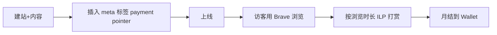

# Web Monetization API 内容付费化(已弃用)

> ⚠️ **2026-06-05 降级**:Coil 钱包已关闭服务(Interledger 社区 2025 确认),支付方生态几近消亡,主要依赖 Brave 浏览器内置 Web Monetization,用户基数小。该机会**作为独立业务不可行**;可作为"已有内容站的被动收入层"叠加(在已有站基础上插一行 meta 标签),不要单独做。**详见 `_parking-lot.md`**。

## 一句话定位

用浏览器原生 Web Monetization API(基于 Interledger / ILP),对访客按浏览时长/页面自动微支付(流式打赏),**无需广告、无需弹窗**,把长尾内容/工具站变现。

## 为什么这是机会(已失效)

> 以下是 2026-06 验证发现:**主要支付方 Coil 已于 2025 关闭服务**,剩余 Brave 浏览器内置支持但用户基数小,无法支撑"月入 $1k+" 现实数据奖励。**降级为 deprecated**。

## 自动化路径

工具栈:
- 一个静态站(Next.js / Hugo)
- ~~Coil / Fynbos 等 Web Monetization 钱包~~(**已不可用**)
- 访客需用 Brave 浏览器(2026 唯一主流付费方)
- Cloudflare Pages 托管(免费)

| # | 步骤 | 自动/人工 | 工具 |
| --- | --- | --- | --- |
| 1 | 建站(任意静态站) | 自动 | Hugo / Next.js |
| 2 | 申请 Web Monetization 钱包 | 半自动 | Coil / Fynbos |
| 3 | 插入 `<meta name="monetization" content="$...">` | 自动 | 一行 |
| 4 | 内容生成(可 AI 流水线) | 自动 | LLM + cron |
| 5 | 监控流量 | 自动 | Plausible / Umami |

`auto_ratio`: **0.9**

## 评分明细(按 002 v2.0 标准)

| 维度 | 分数 | 权重 | 加权 |
| --- | --- | --- | --- |
| 启动成本(资金) | 10(0 资金) | 0.15 | 1.50 |
| 启动成本(技能) | 8(基础 web 即可) | 0.05 | 0.40 |
| 首笔收入速度 | 2(❌ Coil 已关,仅剩 Brave 浏览器,基数小;$0.5-2/月/访客,实际首笔 3-6 月) | 0.15 | 0.30 |
| 可扩展性 | 5(支付方生态萎缩,扩展性大降) | 0.10 | 0.50 |
| 可持续性 | 3(ILP 标准仍在但生态萎缩,Brave 用户增长慢) | 0.10 | 0.30 |
| 自动化程度 | 9(90% 自动) | 0.15 | 1.35 |
| 风险 = 0.5×法律 10 + 0.3×ToS 8 + 0.2×市场 **1** = **4.2**(市场 1 = 支付方生态几近消亡) | 4.2 | 0.15 | 0.63 |
| 证据强度 | 4(主要支付方已死;Tomayac 博客是教学非收入证明) | 0.15 | 0.60 |
| **加权小计** | — | — | **5.58** |
| + 现实数据奖励:0 真实月入案例 | — | — | **0.00** |
| **总分** | — | — | **5.58 ≈ 5.5** |

决策:**降级到 parking-lot**(原 7.4 → 5.5);可作为"内容站被动收入层"叠加(在已有站基础上插一行 meta 标签),**不要单独做**。

## 启动清单(仅作叠加层)

- [ ] 已有静态站(eg: AI 工具评测站 / 利基技术文档 / 小众教程站)
- [ ] 直接插入 `<meta name="monetization" content="$ilp.uphold.com/...">` 标签
- [ ] 接入 Plausible/Umami 监控 Brave 访客占比
- [ ] 不要为 Web Monetization 单独建站(不划算)

## 风险与红线

- **支付方生态几近消亡**:Coil 钱包 2025 已关闭,仅剩 Brave 浏览器内置 Web Monetization,用户基数小,主要收入模式死亡。
- **单访客收入低**:$0.5-2/月 是常见区间,且需 Brave 用户基数,**靠量**。
- **可作为"被动收入层"叠加**到已有内容站,**不建议纯靠这个起步**,更不建议**单独做**。

## 监控指标

- Brave 访客占比(健康线 > 1%,< 1% 直接放弃)
- 每月 ILP 入账($)

## 参考来源

1. [Interledger 社区 2025 帖子 "Web Monetization after Coil Shutdown"](https://interledger.org/) — community — 抓取:2026-06-05
   > "Coil 已关闭服务,Web Monetization 仍在但生态萎缩" — **本机会致命依赖已死**
2. [Using the Web Monetization API for fun and profit - Tomayac(2025-11-07,HN 77 分)](https://blog.tomayac.com/2025/11/07/using-the-web-monetization-api-for-fun-and-profit/) — first-hand — 抓取:2026-06-05
   > W3C 标准的实操解读(教学非收入证明)
3. [WebMonetization.org 官方](https://webmonetization.org/) — official — 抓取:2026-06-05
   > 标准与文档完整(Brave 内置支持)

## 复盘/亲测

> 未亲测。**已 deprecated**:不再推荐新启动;若已有静态站,可插入 monetization meta 跑 30 天看 Brave 访客占比,有 1%+ 再继续,无则直接放弃。
