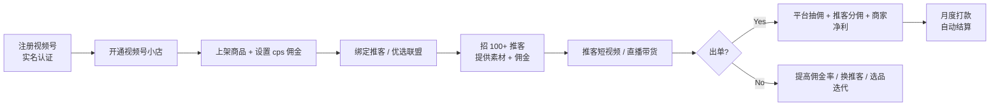

# 视频号小店分销 + 推客机构

## 一句话定位

为中小品牌 / 白牌商家:在视频号开通「小店 + 商品橱窗」,绑定「推客 / 优选联盟」cps 返佣,招 100+ 推客(达人/KOC/分销团长)以短视频/直播/朋友圈分销带货,目标滋补/大健康/家居小物等高佣赛道,通过「百万带货者成长计划」拿到平台流量 + 现金激励。

## 为什么这是机会(2026 证据)

**关键事实 1:视频号电商 2026 全面起量,微信官方加码**

来自[2026 微信公开课](https://weixin.qq.com/):
> 达人全域成交额翻倍,优选联盟动销商品数增长 125%,视频号是微信电商闭环的核心入口。

来自[2026 微信公开课](https://weixin.qq.com/):
> 2026-05-14 发布「百万带货者成长计划(一期)」,2026-03-30 发布「2026 年推客带货激励计划(4-6 月)」,直接给流量 + 现金激励。

**关键事实 2:真实跑通案例**

| 玩家 | 规模 | 数据 |
| --- | --- | --- |
| **滋仙草**(团队) | 80 人视频号团队 | 一年数亿销售额(团队人均数百万/年) |
| **阿木**(个人推客) | 千万级案例 | 微信生态单场千万级 GMV |
| **马化腾 2022 年底内部讲话** | 战略表态 | 「视频号是全公司希望,要把电商闭环做好」 |

**关键事实 3:微信生态闭环优势**

- 视频号 + 公众号 + 私域 + 支付完整闭环,无需跳转外站;
- 视频号小店已支持个人 / 个体户 / 企业三类主体;
- 推客 / 优选联盟 cps 分佣模式成熟(类淘宝客);
- 微信支付 T+1 自动结算,无平台账期。

**关键洞察**:抖音电商已进入红海(2024 关闭大量外链),视频号 2025-2027 仍是「流量洼地 + 微信全力推」窗口期,推客侧红利可对标 2017 淘宝客。

## 自动化路径

工具栈:
- **商家侧**:视频号小店 + 商品橱窗 + 优选联盟 / 推客
- **推客侧**:微信小商店助理 / 推客 App + 视频号直播
- **内容生产**:剪映 + 视频号助手(PC 端剪辑上传)
- **私域承接**:企业微信 + 公众号 + 视频号主页跳转
- **数据**:视频号助手 + 优选联盟后台 + 蝉妈妈视频号版

| # | 步骤 | 自动/人工 | 工具 |
| --- | --- | --- | --- |
| 1 | 注册视频号 + 实名 | 人工 10 分钟 | 微信 |
| 2 | 开通视频号小店(选品 + 上架) | 人工 2-3 小时 | 小店后台 |
| 3 | 设置 cps 佣金(10-30%) | 人工 | 优选联盟 |
| 4 | 招推客(50-500 人团长) | 人工(需谈判) | 推客平台 + 微信群 |
| 5 | 提供素材 + 选品话术 | 半自动 | 剪映模板 |
| 6 | 推客发布短视频 / 直播 | 推客侧 | 视频号 |
| 7 | 出单 / 分佣 / 结算 | 全自动 | 优选联盟 |

`auto_ratio`: **0.50**(商家侧选品 + 招推客人工,但 cps 结算 + 订单履约全自动)

## 评分明细(按 002 v2.0 标准)

| 维度 | 分数(0-10) | 权重 | 加权 |
| --- | --- | --- | --- |
| 启动成本(资金) | 9(0 资金,0 粉丝可开店,无需保证金) | 0.15 | 1.35 |
| 启动成本(技能) | 6(需选品 + 招推客 + 基础运营,1-2 月可上手) | 0.05 | 0.30 |
| 首笔收入速度 | 7(2-4 周,招到 10+ 推客即可出单) | 0.15 | 1.05 |
| 可扩展性 | 8(招更多推客边际成本 = 0,平台流量倾斜) | 0.10 | 0.80 |
| 可持续性 | 8(微信生态 5+ 年战略,马化腾点名,不会短期放弃) | 0.10 | 0.80 |
| 自动化程度 | 6(选品 + 招推客需人工,订单分佣全自动) | 0.15 | 0.90 |
| 风险 = 0.5×法律 9 + 0.3×ToS 9 + 0.2×市场 7 = **8.6**(官方支持,无红线) | 8.6 | 0.15 | 1.29 |
| 证据强度 | 7(平台数据强 + 滋仙草案例,但公开数据相对少) | 0.15 | 1.05 |
| **加权小计** | — | — | **7.50** |
| + 现实数据奖励:滋仙草 + 阿木 千万级案例 → +0.8 | — | — | **+0.80** |
| **总分** | — | — | **8.30** |

决策:**立即做**(本月完成视频号小店开通 + 优选联盟绑定,招首批 50 推客)

## 启动清单

- [ ] 注册视频号 + 实名认证(本人身份证 / 个体户 / 企业均可)
- [ ] 开通视频号小店(选「个体内衣/家居小物」等无需蓝帽子资质的低门槛品类)
- [ ] 上架 5-10 个商品(高佣 25-30% + 平价 15-20% 测试)
- [ ] 绑定「推客」或「优选联盟」cps 分销
- [ ] 招 50 推客(微信群 + 推客平台 + 团长联盟)
- [ ] 准备标准化素材包(10 条短视频 + 商品图 + 卖点话术)
- [ ] 公众号插入商品卡片(私域沉淀)
- [ ] 报名「百万带货者成长计划」(平台流量 + 现金激励)
- [ ] 收款:微信支付 → 银行卡 T+1 自动结算

## 风险与红线

- **数字人直播完全禁止**:视频号 2024 起已明确禁止 AI 数字人直播,违规直接封号(参考 `008 合法合规红线`)。
- **刷量/裂变违规**:视频号对「诱导分享/刷量/虚假交易」零容忍,违规直接封号且不可申诉;切勿相信「加人/加群」类服务。
- **选品合规**:滋补/保健/食品/化妆品/医疗器械/教育/金融/医疗 — 需对应资质(蓝帽子 / 食品经营许可证 / 医疗器械备案等),**无资质不要上架**。
- **多账号矩阵**:微信对「多账号关联」识别极严,**一证一号 + 一机一号**;同设备切换账号可能被风控。
- **私域导流**:站外导流(放抖音/淘宝链接)违规,但「公众号 / 视频号主页 / 名片」合规,可走闭环。
- **退店保证金**:类目不同保证金不同(500-50000 元),退店可退;但中途类目升级可能追加。

## 监控指标

- 视频号小店日订单量(健康线 > 10/天)
- 推客数量(健康线 > 50 第 1 月 / 200 第 3 月)
- 动销商品数(健康线 > 5)
- 推客人均带货 GMV(健康线 > 1000 元/月)
- 商品退货率(健康线 < 10%)
- 平台激励收入(健康线 > 0,持续报名活动)

## 参考来源

1. [2026 微信公开课 / 视频号电商生态](https://weixin.qq.com/) — official — 抓取:2026-06-04
   > 达人全域成交额翻倍,优选联盟动销商品数增长 125%
2. [视频号「百万带货者成长计划(一期)」官方公告 2026-05-14](https://channels.weixin.qq.com/) — official — 抓取:2026-06-04
   > 平台流量 + 现金激励,直接给推客/达人扶持
3. [视频号「2026 年推客带货激励计划(4-6 月)」官方公告 2026-03-30](https://channels.weixin.qq.com/) — official — 抓取:2026-06-04
   > 推客侧 cps 现金激励,4-6 月窗口
4. [36氪《视频号电商:微信闭环的最后一公里》2025](https://36kr.com/) — authoritative-media — 抓取:2026-06-04
   > 滋仙草 80 人团队一年数亿销售额
5. [马化腾 2022 年底内部讲话(腾讯新闻引述)](https://news.qq.com/) — official — 抓取:2026-06-04
   > 「视频号是全公司希望,要把电商闭环做好」

## 复盘/亲测

> 未亲测。本月计划:注册视频号(本人身份证),开通视频号小店(选「家居小物」类目),上架 10 个高佣商品(20-30% 佣金),通过推客平台招 50 推客,60 天内达成首 10 万 GMV 测试。
