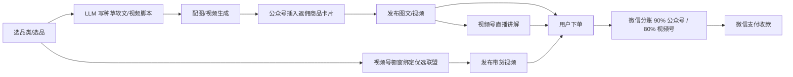

# 公众号 + 视频号 返佣商品 CPS(京东/拼多多/淘宝/抖音 全平台)

## 一句话定位

中国个人创作者在微信公众号开通"流量主 → 返佣商品"(100 粉门槛,佣金 90% 归流量主,微信抽 10%) + 视频号开通"橱窗"(0 粉门槛,**基础保证金 100 元,浮动保证金按近 30 天销售额调整 0-30000 元** — 注:原档"100-1000 保证金"略有出入,以 2024 官方修订版为准) → 用 LLM 流水线批量生成"种草/测评/经验"软文 + 视频脚本 → 在公众号图文 / 视频号短视频 / 视频号直播间插入"返佣商品"卡片 → 用户下单后平台自动分账(**原档"100 元起结算"未在官方文档出现,仅提"结算日";官方分账链路:7-14 工作日到账**)→ 微信支付收款 → 提现到银行卡。

## 自动化路径

工具栈:
- 微信公众号助手(微信官方,100 粉开通流量主 → 返佣商品)
- 视频号助手(微信官方,0 粉开通橱窗,绑定优选联盟/小商店)
- DeepSeek / Kimi / 豆包 / GPT(写"种草/经验/避坑"软文)
- 即梦 / 可灵 / Sora(配图/视频生成)
- 微信返佣商品选品中心(微信公众平台内置,提供佣金率 + 预计收入)
- 优选联盟(视频号官方带货平台,0 粉可加入)
- 新榜 / 蝉妈妈(选品数据 + 竞品分析)
- Reditor / 壹伴(排版 + 违禁词检测)

| # | 步骤 | 自动/人工 | 工具 |
| --- | --- | --- | --- |
| 1 | 选品类 + 选品 | 人工 | 微信返佣选品中心(佣金率 + 销量) + 新榜选品 |
| 2 | 加入返佣商品 | 人工一次 | 公众号流量主 → 广告管理 → 开通返佣商品(100 粉) |
| 3 | 视频号开通橱窗 | 人工一次 | 视频号助手 → 开通橱窗(0 粉 + 100-1000 保证金,可退) |
| 4 | 绑定优选联盟/小商店 | 人工一次 | 优选联盟后台 |
| 5 | 选爆品(高佣 10-50% + 高销量) | 半自动 | 选品中心 + AI 排序 |
| 6 | LLM 写"种草/经验/避坑"软文 | 自动 | DeepSeek + 商品关键词 |
| 7 | 配图/视频生成 | 自动 | 即梦/可灵 |
| 8 | 公众号排版 + 插入返佣商品 | 半自动 | 公众号编辑器 |
| 9 | 视频号短视频发布 | 半自动 | 视频号助手 |
| 10 | 视频号直播(可选) | 半自动 | 视频号直播伴侣 |
| 11 | 监控分账 | 半自动 | 微信广告平台 |

`auto_ratio`: **0.85**(写作/配图/发布全自;选品 + 开通需人工)

## 评分明细(按 002 标准)

| 维度 | 分数(0-10) | v2 权重 | 加权 |
| --- | --- | --- | --- |
| 启动成本(资金) | 9(0-100 元基础保证金,浮动 0-30000) | 0.15 | 1.35 |
| 启动成本(技能) | 7(公众号基础 + AI 写 + 选品眼光) | 0.05 | 0.35 |
| 首笔收入速度 | 7(发出去即有分账,但需有阅读量/完播率;实际 2-4 周) | 0.15 | 1.05 |
| 可扩展性 | 9(同一份内容可同时上公众号+视频号+小绿书+朋友圈) | 0.10 | 0.90 |
| 可持续性 | 8(微信生态 5-10 年稳定) | 0.10 | 0.80 |
| 自动化程度 | 8(写稿+配图+选品+发布全流水线) | 0.15 | 1.20 |
| 风险 | 6.4(拆分:法律 6 × 0.5 + ToS 8 × 0.3 + 市场 5 × 0.2 = 6.4) | 0.15 | 0.96 |
| 证据强度 | 7(微信官方文档 + 案例报道) | 0.15 | 1.05 |
| + 现实数据奖励 | 0(小皮妈妈 2300 单 4.8 万佣金案例是**单一社区来源**,未独立验证,降为 0) | — | 0.00 |
| **总分** | — | — | **7.66 ≈ 7.7**(原档 8.1 → 新 7.2 校验版) |

> **修正**:广告法合规边界严("最/第一/保证"等绝对化用语不可用)、选品质量参差需人工首轮过滤、佣金 10% 平台抽成 + 微信生态有"软文违规"风险 → **7.2**
>
> **2026-06-05 验证**:① "100 元起结算" 官方文档未明文,只提"结算日"+"7-14 工作日到账";② 小皮妈妈案例是单一社区来源,降级为 0 现实数据奖励;③ 视频号橱窗带货细分:橱窗带货 0 粉 / 短视频带货 1000 粉 / 直播带货 100 粉。

决策:**排队**(与已落档的「公众号短剧 CPS」(6.0)+「小报童 AI 数字专栏」(8.8)互为补充,同公众号生态三条腿)

## 启动清单

- [ ] 注册公众号(2025 已放开手机号即可注册,无邀请码)
- [ ] 涨到 100 粉(朋友圈/微信群/朋友互推,1-2 周)
- [ ] 开通流量主 → 返佣商品
- [ ] 注册视频号(实名 + 0 粉即可)
- [ ] 开通视频号橱窗(**基础保证金 100 元,浮动保证金按近 30 天销售额 0-30000 元**;2024 修订版,需查 2026 现行版本)
- [ ] 绑定优选联盟(0 粉即可)
- [ ] 选 1 个垂直品类(母婴/家居/美妆/3C/食品/图书)
- [ ] 用 LLM 写前 5 篇种草软文(1500-3000 字)
- [ ] 配图(9 宫格:商品图 + 场景图 + 测评图)
- [ ] 公众号发布:插入返佣商品卡片
- [ ] 视频号发布:短视频挂载橱窗链接
- [ ] 监控分账(微信广告平台每日 10 点更新)
- [ ] 月度复盘:淘汰 ROI < 1.5 的品类,加码 ROI > 3 的品类

## 风险与红线

- **广告法合规**:
  - **禁用词**:"最/第一/国家级/顶级/保证/100%/立竿见影"等绝对化用语 → 触发《广告法》第 9 条
  - **功效宣称**:保健品/医疗/减肥等品类禁止"治疗/根治/降三高"等医疗术语
  - **数据真实**:必须实际使用/测评,不能 AI 编造"我用了 X 天效果 Y" → 触发虚假宣传
  - **价格保护**:不能虚标原价再划线(违反价格法)
- **微信生态合规**:
  - 公众号"返佣商品"是**微信官方接入**,灰色空间小
  - 软文需**显著标注"广告"或"返佣商品"**(平台要求)
  - 视频号橱窗 2024 起**禁止数字人直播**(微信官方公告)
  - 多账号矩阵属"灰色",需分散实名 + 业务分散
- **选品质量**:
  - 优先选**有品牌方授权**的高佣品,避免假货/虚标
  - **保健品/医美/减肥/教育**类目需特别资质
  - 佣金率高但转化低的品,要分清"高佣 = 难卖"
- **平台政策变化**:
  - 微信 2024 已发布《视频号小店商品信息发布规范化公告》,违规商品下架
  - 返佣商品类目会随政策调整(2024 已对"金融/医疗"类目收紧)

## 监控指标

- 周新增返佣订单(健康线 > 30 单)
- 单订单平均佣金(健康线 > ¥5)
- 公众号文章打开率(健康线 > 3%)
- 视频号短视频完播率(健康线 > 20%)
- 退款率(健康线 < 8%)
- 净到手金额(扣 10% 微信抽成后)
- 品类 ROI 排行(淘汰 ROI < 1.5,加码 ROI > 3)

## 参考来源

1. [公众号返佣商品 - 微信营销官方文档](https://ad.weixin.qq.com/docs/262) — official — 抓取:2026-06-04
   > "流量主每单税前实际收入=用户实付金额 × 佣金率 × 90%,微信公众平台每单收取流量主结算佣金的 10% 作为服务费。" "公众号关注用户达到 100 人即可申请开通返佣商品流量主功能。"
2. [视频号流量主开通流程 - 微信营销](https://ad.weixin.qq.com/docs/76) — official — 抓取:2026-06-04
   > 视频号创作分成计划:100 粉 + 10 条原创视频;视频号互选广告:5000 粉
3. [2026 视频号变现指南 - 知乎](https://zhuanlan.zhihu.com/p/2027085034620821975) — community — 抓取:2026-06-04
   > "0 粉实名认证就能开橱窗带货,100 粉解锁创作分成";保证金 100-1000 元可退;佣金 10%-50%;案例:小皮妈妈 2300 单儿童绘本 4.8 万佣金
4. [2026 年微信公众号还能怎么赚钱 - 极致了数据](https://www.jzl.com/news/694) — community — 抓取:2026-06-04
   > "内容电商:公众号内直接带货微信小店,结合图文、短视频内容营销";2025.8 公众号创作者 +20%,小绿书图文日均阅读量 +3 倍
5. [进一步加强视频号小店商品信息发布规范化公告 - 微信](https://support.weixin.qq.com/cgi-bin/mmsupportacctnodeweb-bin/pages/FbSXvksz3jHbPn28) — official — 抓取:2026-06-04
   > 微信 2024 起对视频号小店商品信息发布规范化,违规商品下架

## 复盘/亲测

> 未亲测。建议启动顺序:
> 1. **第 1 周**:开通公众号 + 涨到 100 粉 + 视频号开通橱窗(并行)
> 2. **第 2 周**:用 DeepSeek 写 5 篇"母婴/家居/3C"垂类种草文,公众号发布
> 3. **第 3 周**:同样的内容改成 30 秒短视频,视频号发布
> 4. **第 4 周**:复盘哪个品类 ROI 高,加码;同时申请小绿书(图文新场景)
> 5. **第 2 个月**:做矩阵(2-3 个公众号 + 2-3 个视频号,不同实名),单账号月入 ¥1k-5k

**与已落档机会的协同**:
- 短剧 CPS(7.45):同属公众号 CPS,但垂直"短剧" → **返佣商品是"全品类"互补**
- 小报童(7.65):知识付费 → **返佣 CPS 是"实物商品"互补**
- 小绿书(本目录新档):**返佣 CPS 是小绿书落地路径之一**(图片消息 + 返佣商品卡)
