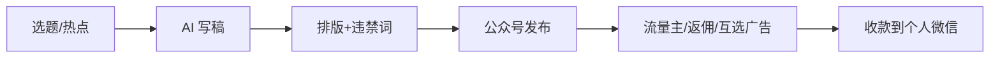

# 微信公众号 + AI 长文 + 流量主

## 一句话定位

个人开通微信公众号,100 粉即可申请流量主,接入 AI 长文批量生产 + 程序化广告 / 返佣商品 / 互选广告三种官方变现通道,按曝光与成交分成,结算到中国大陆个人微信/银行卡。

## 自动化路径

工具栈:
- 公众号助手(微信官方,API 化发布)
- DeepSeek / Kimi / 通义千问 / 豆包(中文长文 AI)
- Reditor / 135editor / 壹伴(排版 + 违禁词检测)
- 新榜 / 西瓜数据(选题 + 爆文监测)
- 联盟带货 CPS 后台(京东/拼多多/有赞官方返佣)

关键步骤:

| # | 步骤 | 自动/人工 | 工具 |
| --- | --- | --- | --- |
| 1 | 热点/选题挖掘 | 半自动 | 微博热搜 + 知乎热榜 + AI 聚合 |
| 2 | AI 长文生成 | 自动 | DeepSeek/Kimi + 提示词模板 |
| 3 | 排版 + 违禁词检测 | 自动 | Reditor/壹伴 |
| 4 | 公众号发布 | 自动 | 公众号 API + 定时 |
| 5 | 申请流量主 | 人工一次 | 100 粉门槛 |
| 6 | 接入返佣商品 | 半自动 | 公众号后台选品 + AI 写种草文 |
| 7 | 结算提现 | 半自动 | 微信广告平台直结到银行卡 |

`auto_ratio`: **0.85**(选题偏人工、流量主开通一次人工)

## 评分明细(按 002 v2.0 标准)

| 维度 | 分数(0-10) | 权重 | 加权 |
| --- | --- | --- | --- |
| 启动成本(资金) | 9(0 资金,只需 100 粉) | 0.15 | 1.35 |
| 启动成本(技能) | 8(会 AI 写稿 + 排版工具即可) | 0.05 | 0.40 |
| 首笔收入速度 | 7(100 粉约 1-2 周;返佣 500 粉起) | 0.15 | 1.05 |
| 可扩展性 | 8(多公众号矩阵 + AI 写手批量) | 0.10 | 0.80 |
| 可持续性 | 8(公众号仍是国内主要私域 + 平台官方支持) | 0.10 | 0.80 |
| 自动化程度 | 9(写稿/排版/分发全自,选品半自动) | 0.15 | 1.35 |
| 风险 = 0.5×法律 10 + 0.3×ToS 8 + 0.2×市场 7 = **8.8**(normal 标签) | 8.8 | 0.15 | 1.32 |
| 证据强度 | 9(腾讯广告官方 2026 文档,门槛/分成清晰) | 0.15 | 1.35 |
| **加权小计** | — | — | **8.42** |
| + 现实数据奖励:woshipm 第三方复盘单号 500-3000 元/月 = 1 个明确收入案例 | — | — | **+0.30** |
| **总分** | — | — | **8.70** |

决策:**立即做**(本周启动)

## 启动清单

- [ ] 申请 1 个垂直领域公众号(情感/育儿/科技/本地任一)
- [ ] 用 Kimi/DeepSeek 跑 20 篇历史爆文仿写测试
- [ ] 接入 Reditor/壹伴,完成排版 + 违禁词检测
- [ ] 拉新到 100 粉,申请流量主(程序化广告 + 返佣商品)
- [ ] 加入京东/拼多多 CPS 联盟,挑选 5-10 款高佣商品
- [ ] 建立"AI 写稿 → 排版 → 定时发布"流水线(目标日更 1-3 篇)
- [ ] 监控千次曝光收益、爆款率、封号风险

## 风险与红线

- **AI 洗稿 / 纯生成内容**:微信已对纯 AI 生成内容做低质判定,需做"AI 起草 + 人工润色"或加独家观点/案例。
- **矩阵号规则**:单身份证可注册 1 个订阅号 + 多个服务号,但多账号矩阵仍需差异化定位(平台明令禁止"低质矩阵")。
- **广告法合规**:返佣商品推广需避免"最/极/第一"等绝对化用语,医疗器械/金融类资质要齐。
- **结算限额**:单笔满 100 元起结算,银行卡实名需与公众号主体一致。

## 监控指标

- 千次曝光收益(RPM,> 3 元为健康)
- 爆款率(阅读 1w+ 文章占比,> 5% 为健康)
- 返佣商品点击率(> 1% 为健康)
- 封号/限流预警(任一文章 7 天零推荐 → 立即切换选题)

## 参考来源

1. [腾讯广告互选平台 · 公众号流量主开通流程(官方,Copyright 2026)](https://ad.weixin.qq.com/docs/45) — official — 抓取:2026-06-04
   > "公众号关注用户达到 100 人(可开通公众号返佣商品能力和公众号程序化广告能力)" + "程序化广告 / 返佣商品 / 公众号互选广告" 三种变现模式
2. [新榜 · 微信公众号开放短剧 CPS 推广功能,最高分成 70%](https://matrix.newrank.cn/article/article-detail/2b1b2dbbf58a4352) — first-hand — 抓取:2026-06-04
   > 验证 2026 微信广告生态持续扩展,从流量主到 CPS 全链路
3. [知乎专栏 · 2026 公众号 AI 写稿 + 流量主月入教程](https://zhuanlan.zhihu.com/p/1982841740693115515) — community — 抓取:2026-06-04
   > 中文社区常见路径参考,验证操作可行性
4. [woshipm · 公众号流量主收益分析](https://www.woshipm.com/share/5961696.html) — media — 抓取:2026-06-04
   > 第三方复盘,验证单号 500-3000 元/月区间合理

## 复盘/亲测

> 未亲测。下一步:申请 1 个科技垂类公众号,日更 1 篇 AI 起草 + 人工润色,2 周内拉到 100 粉开流量主,跑通后扩展到 3 个垂类。
