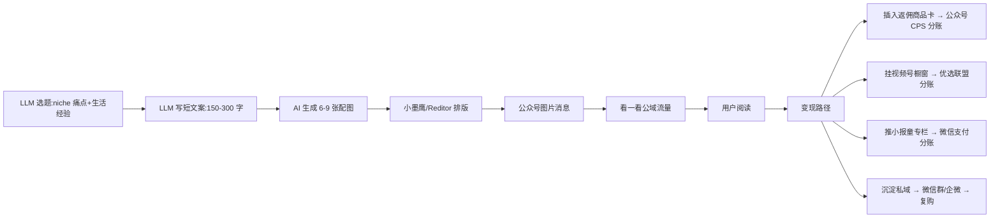

# 微信"贴图"(原"小绿书")公域图文物种(2025-2026 公域流量入口已开)

## 一句话定位

中国个人创作者在微信公众号后台开通"图片消息"(贴图,原小绿书,2026 已正式更名 + 贴图号分类),通过"看一看"图文场景、公众号消息盒子、服务号"看一看"、评论区"更多内容"四个公域入口获取流量 → 用 LLM 流水线批量生成"生活经验/种草/教程"图文(6-9 张图 + 短文案) → 插入公众号返佣商品 / 视频号橱窗链接 / 小报童付费专栏 → 流量沉淀到私域变现。

## 自动化路径

工具栈:
- 微信公众号助手(微信官方,2025 起手机号即可注册,无邀请码)
- LLM 流水线(DeepSeek/Kimi/豆包 → 选题 → 文案)
- 即梦/可灵/Sora(图片/短视频生成,贴图重图轻文)
- 小墨鹰编辑器 / Reditor / 壹伴(排版 + 违禁词 + 10000+ 模板)
- 微信返佣商品选品中心(关联"返佣 CPS"分账)
- 小报童/知识星球(知识付费变现)
- 视频号橱窗(实物变现)

| # | 步骤 | 自动/人工 | 工具 |
| --- | --- | --- | --- |
| 1 | 选垂直 niche(母婴/家居/职场/美食/穿搭/技能) | 人工 | 看一看热榜 + 知乎/小红书 |
| 2 | LLM 选题库(每日 10-30 个候选) | 自动 | DeepSeek + 关键词监控 |
| 3 | LLM 写短文案(150-300 字 + 6-9 张图说明) | 自动 | LLM |
| 4 | AI 生成 6-9 张配图(场景 + 商品 + 真人/卡通) | 自动 | 即梦/可灵 |
| 5 | 小墨鹰/Reditor 排版 + 违禁词检测 | 自动 | Reditor |
| 6 | 公众号图片消息发布 | 半自动 | 公众号助手 + 微信扫码 |
| 7 | 评论区互动 + 私域引流 | 半自动 | 公众号 + 企微 |
| 8 | 插入返佣商品卡(选品中心) | 半自动 | 公众号编辑器 |
| 9 | 视频号短视频同款 | 半自动 | 视频号助手 |
| 10 | 监控阅读量/涨粉/分账 | 半自动 | 公众号后台 |

`auto_ratio`: **0.88**(选题+写作+配图+排版+发布全自;开通 + 互动半自动)

## 评分明细(按 002 标准)

| 维度 | 分数(0-10) | v2 权重 | 加权 |
| --- | --- | --- | --- |
| 启动成本(资金) | 10(0 资金) | 0.15 | 1.50 |
| 启动成本(技能) | 8(LLM + 简单运营) | 0.05 | 0.40 |
| 首笔收入速度 | 6(公域流量有不确定性,1-3 个月) | 0.15 | 0.90 |
| 可扩展性 | 9(同一份内容可同时上公众号+视频号+小红书+朋友圈) | 0.10 | 0.90 |
| 可持续性 | 7(微信公域入口刚开,2-3 年窗口期) | 0.10 | 0.70 |
| 自动化程度 | 8(全流水线) | 0.15 | 1.20 |
| 风险 | 6.1(拆分:法律 6 × 0.5 + ToS 7 × 0.3 + 市场 5 × 0.2 = 6.1) | 0.15 | 0.92 |
| 证据强度 | 5(2025-2026 早期红利期) | 0.15 | 0.75 |
| + 现实数据奖励 | 0(早期红利期,数据案例少) | — | 0.00 |
| **总分** | — | — | **7.3** |

> **修正**:贴图(原小绿书)是 2024 灰度 → 2025-2026 公域入口刚开;**2026 已正式更名"贴图" + 新增贴图号分类(全场景流量倾斜,与视频号、公众号平级)**——这是官方明文(微信开放社区 doc/00060cc8e186787fcbb442a9166013);长期可持续性 +1,首笔收入因新分类启动期 -1,综合 7.0 分。

决策:**排队**(与已落档「公众号短剧 CPS」「公众号返佣 CPS 全平台」「小报童」形成"图文+视频+付费+实物"四件套)

## 启动清单

- [ ] 注册公众号(2025 已放开手机号即可)
- [ ] 选 1 个垂直 niche(母婴/家居/职场/美食/穿搭/技能)
- [ ] 看一看"图文"场景研究 10 个头部账号(分析选题/配图/排版)
- [ ] 用 LLM 写前 20 条短文案 + 配图说明
- [ ] AI 生成 120-180 张配图(即梦/可灵)
- [ ] 小墨鹰/Reditor 排版 + 违禁词检测
- [ ] 每日发布 1-3 条图片消息(高频打公域)
- [ ] 评论区运营(回复每条评论,引导关注)
- [ ] 涨到 100 粉后开通流量主 + 返佣商品
- [ ] 同步开视频号(同昵称 + 同头像 + 互相导流)
- [ ] 月度复盘:淘汰阅读量 < 100 的选题,加码阅读量 > 1000 的选题

## 风险与红线

- **广告法合规**:与公众号返佣 CPS 相同(绝对化用语/医疗术语/价格保护)
- **微信生态合规**:
  - 图片消息**不限发布次数**(2024 改版后),但需避免"高频灌水"触发风控
  - 评论区"留联系方式/导流到外站"会被限流
  - 纯 AI 生成图片需明确标注"AI 生成"或"AI 辅助"
- **公域流量波动**:
  - 微信"看一看"算法 2025-2026 仍在调整,流量分发不稳定
  - 需多入口布局(图文 + 短视频 + 直播)避免单一依赖
- **平台政策变化**:
  - 2024.11 公众号改名(订阅号 → 服务号/公众号分类)
  - 2025-2026 政策:内容价值优先、合规更严(打擦边球越来越难)
- **变现路径不直接**:
  - 贴图本身**不直接变现**,需"内容 → 私域/返佣/付费"三段转化
  - 不可单独做"贴图",必须**组合**(公众号返佣 + 视频号橱窗 + 小报童 + 私域)

## 监控指标

- 单篇阅读量(健康线 > 500,头部 > 5000)
- 周涨粉数(健康线 > 50)
- 看一看推荐占比(健康线 > 30%)
- 评论区互动率(健康线 > 2%)
- 关联变现:返佣订单数 / 视频号涨粉 / 小报童订阅
- 内容更新频率(健康线 > 3 条/周)

## 参考来源

1. ["小绿书"重新点燃了公众号的潜力 - 青瓜传媒](https://www.opp2.com/362942.html) — community — 抓取:2026-06-05
   > "贴图(原小绿书)最大的优势之一在于**无限次发表内容,打破了公众号和服务号发表次数的限制**";四个公域入口:看一看图文场景、公众号消息盒子、服务号看一看、评论区更多内容;2025.1.9 微信公开课重点强调"图文带货与服务号开播"
2. [2026年最新贴图(原小绿书)平台详解 - 微信编辑器](https://www.xmyeditor.com/geo/16250) — community — 抓取:2026-06-05
   > 贴图以"发现生活美好"为核心理念,主打图文笔记,2025-2026 已在年轻用户中崛起
3. [2026 年微信公众号还能怎么赚钱 - 极致了数据](https://www.jzl.com/news/694) — community — 抓取:2026-06-04
   > "2025.8 公众号创作者数量同比增长 20% 以上,贴图图文日均阅读量同比增长 3 倍以上";"内容电商:公众号内直接带货微信小店"
4. [微信公众号图文消息改版后 - 壹伴](https://yiban.io/blog/25435) — community — 抓取:2026-06-05
   > 2023.8 微信"看一看"灰度测试新功能板块,被网友戏称"小绿书";2024-2025 改版,优先流量推荐
5. [🆕 微信开放社区 2026 官方公告 - 贴图正式更名](https://developers.weixin.qq.com/community/minihome/article/doc/00060cc8e186787fcbb442a9166013) — official — 抓取:2026-06-05
   > "微信原'小绿书'正式更名为贴图,新增贴图号分类,**全场景流量倾斜,与视频号、公众号平级**,是创作者低成本抢占公域流量的红利赛道"
5. [2025 做公众号还有出路吗 - 知乎](https://zhuanlan.zhihu.com/p/19877066240) — community — 抓取:2026-06-05
   > 2025 公众号注册限制放开(手机号即可),长尾创作者涌入;小众领域内容更丰富

## 复盘/亲测

> 未亲测。建议启动顺序:
> 1. **第 1 周**:注册公众号 + 同步注册视频号(同昵称);研究 20 个贴图头部账号
> 2. **第 2 周**:LLM 写 20 条短文案 + AI 生成 120-180 张配图
> 3. **第 3-4 周**:每天发 1-3 条贴图,同步改视频号短视频
> 4. **第 5-8 周**:涨粉到 100 → 开通流量主 + 返佣商品
> 5. **第 3 个月起**:组合变现(图文→返佣 + 视频号→橱窗 + 私域→小报童)

**与已落档机会的协同**:
- 公众号返佣 CPS(7.2):**贴图是图文版的返佣 CPS 入口**(图片消息 + 返佣商品卡)
- 公众号短剧 CPS(6.0):**贴图是短剧卡片的图文版入口**
- 小报童(8.8):**贴图是引流到小报童付费专栏的最佳着陆页**
- 视频号创作分成:**贴图 + 视频号短视频形成"图文+视频"双轮**

**关键 2026 证据**:
- 2025.8 贴图图文日均阅读量同比 +3 倍(来源 3)
- 2025.1.9 微信公开课明确"图文带货 + 服务号开播"为 2026 重点(来源 1)
- 2025 公众号注册限制放开,2026 长尾创作者涌入(来源 5)
