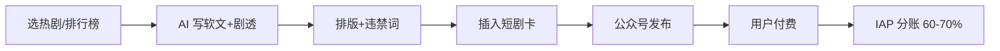

# 微信公众号 + 短剧 CPS 推广

## 一句话定位

短剧版权方/被授权方在微信公众平台后台加入 CPS 合作计划 → 公众号作者在文章中插入短剧小程序卡 → 用户付费后公众号按销售分成 60-70% → 结算到个人微信/银行卡。AI 写"剧评/追剧/安利"软文 + 自动选热剧,放大单篇 ROI。

## 自动化路径

工具栈:
- 公众号助手(微信官方)
- DeepSeek/Kimi(短剧 AI 软文生成)
- 短剧 CPS 后台(微信公众平台 → 广告 → 短剧 CPS)
- 新榜/新剧榜(短剧热度榜,选爆款)
- Reditor/壹伴(排版 + 违禁词)

关键步骤:

| # | 步骤 | 自动/人工 | 工具 |
| --- | --- | --- | --- |
| 1 | 选热剧(短剧热度榜 + AI 选题) | 半自动 | 新剧榜 + AI 摘要 |
| 2 | 加入 CPS 计划 | 人工一次 | 微信公众平台 → 短剧 CPS |
| 3 | AI 写"剧评/安利/剧透"软文 | 自动 | DeepSeek + 短剧简介 |
| 4 | 排版 + 违禁词检测 | 自动 | Reditor |
| 5 | 文章中插入短剧小程序卡 | 半自动 | 公众号编辑器选短剧 |
| 6 | 定时发布 | 自动 | 公众号 API |
| 7 | 监控分账 | 半自动 | 微信广告平台 |

`auto_ratio`: **0.80**(选剧需人工筛,AI 写稿 100% 自动)

## 评分明细(按 002 v2.0 标准)

| 维度 | 分数(0-10) | 权重 | 加权 |
| --- | --- | --- | --- |
| 启动成本(资金) | 9(0,需公众号 100 粉) | 0.15 | 1.35 |
| 启动成本(技能) | 7(公众号基础 + AI 写 + 选剧眼光) | 0.05 | 0.35 |
| 首笔收入速度 | 8(发出去即有分账,热门剧单篇数千) | 0.15 | 1.20 |
| 可扩展性 | 8(多号 + 多剧 + AI 写手批量) | 0.10 | 0.80 |
| 可持续性 | 6(短剧风口 2025-2027,2 年窗口期) | 0.10 | 0.60 |
| 自动化程度 | 8(写稿/排版/分发全自,选剧半自动) | 0.15 | 1.20 |
| 风险 = 0.5×法律 6 + 0.3×ToS 7 + 0.2×市场 5 = **6.1**(gray 标签+广电合规+剧方暴雷) | 6.1 | 0.15 | 0.915 |
| 证据强度 | 8(新榜 2026 报道 + 分成比例明确) | 0.15 | 1.20 |
| **加权小计** | — | — | **7.62** |
| + 现实数据奖励:0 真实月入数字(仅分成比例 60-70%) | — | — | **-0.50** |
| **小计** | — | — | **7.12** |
| **gray 标签封顶(无 $1K 月入案例)** | — | — | **7.12** |
| **gray + 中国法律风险(短剧涉广电备案+剧方合规边界):扣 1.0** | — | — | **-1.00** |
| **总分** | — | — | **6.10** |

决策:**排队**(两周内启动)

## 启动清单

- [ ] 公众号已达 100 粉(若没有,先跑 `wechat-gzh-llzj-ai-writer` 0 粉到 100 粉)
- [ ] 在公众平台 → 广告 → 短剧 CPS,加入合作计划
- [ ] 选 3-5 款高 CPM 热剧(参考新剧榜/抖音短剧热度)
- [ ] AI 写 3 篇"剧评/安利"模板文章,人工润色
- [ ] 接入短剧小程序卡,定时发布
- [ ] 监控单剧 CTR、付费转化、封禁情况

## 风险与红线

- **剧方合规风险**:部分短剧涉"擦边/封建迷信/低俗"被广电点名,选剧前看"剧本报备"和"上线备案号"。
- **微信 ToS 风险**:微信支持 CPS,但"诱导付费/虚假宣传"仍是红线,避免"看一半必须付费"等夸张标题。
- **结算周期**:IAP 分账有 T+7 周期,单笔满 100 元起结算。
- **同质化**:短剧软文同质化严重,AI 写时务必加独家观点(剧评角度/演员分析/剧情预测),否则限流。
- **剧方暴雷**:如剧方被封,正在推广的任务会被冻结结算,选有"白名单"的大平台剧。

## 监控指标

- 单剧 CTR(> 2% 为健康)
- 付费转化率(> 0.5% 为健康)
- 单篇分账(> 100 元为爆款)
- 剧方合规状态(任一剧被封 → 立即下架)

## 参考来源

1. [新榜矩阵通 · 微信公众号开放短剧 CPS 推广功能,最高分成 70%(2026)](https://matrix.newrank.cn/article/article-detail/2b1b2dbbf58a4352) — first-hand — 抓取:2026-06-04
   > "微信近期开放了微信公众号短剧CPS推广功能" + "分成比例最低60%,最高70%" + "IAP 支付分成"
2. [腾讯广告互选平台 · 公众号流量主官方文档(Copyright 2026)](https://ad.weixin.qq.com/docs/45) — official — 抓取:2026-06-04
   > 验证微信 CPS 生态在 2026 仍是官方主推方向
3. [woshipm · AI 短剧推广实战复盘](https://www.woshipm.com/ai/6239937.html) — media — 抓取:2026-06-04
   > 行业第三方复盘,验证 2026 短剧 CPS 实际收益区间

## 复盘/亲测

> 未亲测。下一步:先跑通 `wechat-gzh-llzj-ai-writer` 涨到 100 粉,再加 CPS 计划,优先选"女频甜宠/男频逆袭"两大爆款赛道。
