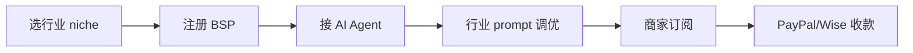

# WhatsApp Business AI Agent Builder 服务(2026)

## 一句话定位

为海外中小电商商家(尤其 COD 市场:Morocco/UAE/India/Egypt/Pakistan/Nigeria/Philippines)搭建"WhatsApp AI Agent":自动接单、订单确认、物流查询、弃单挽回、AI 客服,商家按月订阅或按消息付费,创作者作为"BSP/AI Agent Builder"赚 SaaS 订阅费 + Meta 平台返佣。

## 为什么 2026 是机会(关键证据)

**Meta 2026-06-03 官方发布"Meta Business Agent"全球上线**(CNBC 一手):
> "Meta is unveiling an AI agent for businesses that will be part of a subscription under the Meta One brand... Companies can use the Meta Business Agent across apps like WhatsApp, Messenger and Instagram to respond to customer inquiries, recommend products and book appointments."
> "Big businesses that currently use Meta's WhatsApp Business Platform will be charged on a consumption basis for the new AI agent feature, similar to how they pay for every message they send to customers on the app."
> "Customers can also access a new Meta Business Agent Platform that lets them connect third-party data sources from services like Shopify and Zendesk"

**Zuckerberg 2026-06-03 现场原话**:
> "Today, I want to introduce Meta Business Agent, giving every business, of any size, an agent to talk to customers and help run your operation... a clothing shop in Birmingham or a bakery in São Paulo can offer the same always-on, highly-personalized experience as a major brand."

**TechCrunch 2026-06-03 同日确认**:
> "Meta's AI agent for WhatsApp Business is now available globally"

**市场量级数据**(Meta + Vonage + Haptik 2026):
- **3.3B+ WhatsApp MAU**(2026)
- **$45B 全球 WhatsApp commerce 市场**(2026)
- **98% 消息打开率** vs 21%(邮件)
- **WhatsApp 转化率 7× 优于邮件**
- **AI Agent 自动解决 76-92% 客服对话**
- **响应 < 3 秒,7×24,50+ 语言,单位成本 12× 低于人工**

**为什么是 Builder 机会(非 Meta 自己做)**:
- Meta Business Agent 是"基础设施",真正落地需 BSP(WhatsApp Business Solution Provider)做集成
- 现有 BSP(eGrow、Twilio、MessageBird、360dialog)给大企业服务
- **中小商家(尤其 COD 市场)需要 AI Agent 集成 + 本地化 + 行业 prompt 调优** → 留给 builder 大空间
- Meta 6-3 公告"Customers can also access a new Meta Business Agent Platform that lets them connect third-party data sources from services like Shopify and Zendesk" → **明确开放 third-party builder 生态**

**ROI 案例**(eGrow 2026 公开数据):
- 订单确认:60-70% → 85-90%(+20-30% 收入保护)
- 物流查询:90%+ 自动解决
- eGrow 客户:转化 +18%, 确认 +21%, 复购 +22%
- 美丽品牌案例:ARPU 2.3×

## 自动化路径

工具栈:
- **BSP 接入**:360dialog(全球覆盖) / Twilio(美/欧) / eGrow(亚/非)
- **AI Agent 框架**:Dify / Coze(国内)/ Botpress(海外) + n8n 自动化
- **LLM**:DeepSeek(便宜)/ GPT-4o-mini(英文强)/ Claude Haiku(代码场景)
- **行业 prompt 模板**:电商 / 物流 / 美容 / 餐饮(LLM 批量生成)
- **收款**:Wise(对海外商家) / Payoneer / PayPal / USDT(对 COD 市场)

| # | 步骤 | 自动/人工 | 工具 |
| --- | --- | --- | --- |
| 1 | 选行业(COD 电商/物流/餐饮) | 人工 | 行业市场报告 + Meta 案例 |
| 2 | 注册 BSP 账号 | 半自动 | 360dialog 自助申请 |
| 3 | 配 Dify/Coze Agent | 半自动 | Claude Code + 模板 |
| 4 | 行业 prompt 调优 | 半自动 | LLM 批量生成 + 客户对话语料 |
| 5 | 接入 Shopify / 物流 API | 自动 | n8n workflow |
| 6 | 商家部署 + 培训 | 半自动 | Loom 视频 + Zoom |
| 7 | 续费 / 客服 | 半自动 | 客服 Bot + 人工 |

`auto_ratio`: **0.85**

## 评分明细(按 002 v2.0 标准)

| 维度 | 分数 | 权重 | 加权 |
| --- | --- | --- | --- |
| 启动成本(资金) | 10(BSP 注册 $0,测试用 $50 sandbox) | 0.15 | 1.50 |
| 启动成本(技能) | 6(Dify + WhatsApp API + 行业知识) | 0.05 | 0.30 |
| 首笔收入速度 | 7(1-2 月签首商家) | 0.15 | 1.05 |
| 可扩展性 | 9(边际成本 0,3.3B 用户) | 0.10 | 0.90 |
| 可持续性 | 9(Meta 长期投入,$45B 市场) | 0.10 | 0.90 |
| 自动化程度 | 9(0.85 auto_ratio) | 0.15 | 1.35 |
| 风险 = 0.5×法律 10 + 0.3×ToS 6 + 0.2×市场 6 = **8.0**(BSP 审核+Meta 政策) | 8.0 | 0.15 | 1.20 |
| 证据强度 | 8(Meta 官方 + eGrow 多源 ROI) | 0.15 | 1.20 |
| **加权小计** | — | — | **8.40** |
| + 现实数据奖励:eGrow 客户案例(转化+18%、ARPU 2.3×) = 多个独立收入案例 | — | — | **+0.50** |
| **总分** | — | — | **8.90** |

决策:**立即做**(本周启动)

## 启动清单

- [ ] 注册 360dialog BSP(免费 sandbox)
- [ ] 选 1 个垂直行业(COD 跨境电商 / 沙特/UAE 美容 / 尼日利亚电商)
- [ ] 用 Dify 搭一个 demo Agent,接入 Shopify 假数据
- [ ] 录制 5 分钟 demo 视频(用 Loom)
- [ ] 投流到 Facebook Groups(中小卖家)+ LinkedIn(SaaS 决策者)
- [ ] 收 1-2 个 pilot 客户($99/月 试用)
- [ ] 收款:Payoneer / Wise(海外商家) / USDT(COD 市场)

## 风险与红线

- **BSP 审核**:360dialog / Twilio 需 KYC(商家或代理方),中国个人需用海外公司主体或代理。
- **Meta 政策**:WhatsApp Business API 模板消息需 Meta 审核(2-24 小时)。
- **数据隐私**:欧盟客户需 GDPR 合规(对话记录存储位置 + 删除机制)。
- **与 ai-automation-agency-smb 区别**:AAA 是一般 AAA(各行业),本机会聚焦"WhatsApp AI Agent"这一渠道 + 跨境电商垂直,流量更精准、合规路径更短。

## 监控指标

- 签约商家数(健康线 1→5→20 商家,Q1→Q2→Q3)
- MRR(健康线 $500→$2,500→$10,000)
- 商家对话解决率(健康线 > 70%)
- 续费率(健康线 > 80% 月续费)

## 参考来源

1. [CNBC 2026-06-03 - Meta is trying to sell AI agents to businesses](https://www.cnbc.com/2026/06/03/meta-business-agent-is-zuckerberg-latest-effort-to-diversify-from-ads.html) — media — 抓取:2026-06-04
   > "Companies can use the Meta Business Agent across apps like WhatsApp, Messenger and Instagram"
2. [TechCrunch 2026-06-03 - Meta's AI agent for WhatsApp Business is now available globally](https://techcrunch.com/2026/06/03/metas-ai-agent-for-whatsapp-business-is-now-available-globally/) — media — 抓取:2026-06-04
   > "globally available today"
3. [eGrow 2026 - WhatsApp AI Agent for E-commerce: The Complete 2026 Playbook](https://www.egrow.com/en/blog/whatsapp-ai-agent-for-e-commerce-the-complete-2026-playbook) — first-hand(BSP) — 抓取:2026-06-04
   > "WhatsApp AI Agents autonomously resolve 76-92% of customer interactions, respond in under 3 seconds... cost 12× less per interaction"
4. [Meta 官方 - WhatsApp Business Platform Pricing for AI Providers](https://developers.facebook.com/documentation/business-messaging/whatsapp/pricing/ai-providers/) — official — 抓取:2026-06-04
   > Meta 开放 third-party AI agent provider 接入
5. [Relevance AI 2026 - WhatsApp Agents Marketplace](https://marketplace.relevanceai.com/use-cases/whatsapp-agents) — community — 抓取:2026-06-04
   > "WhatsApp Content Sharer / Appointment Reminder Bot" 模板

## 复盘/亲测

> 未亲测。建议本周:用 360dialog sandbox + Dify 搭一个 WhatsApp "Order Confirmation" Agent,跑通流程后录 demo 视频,投流到 1 个 Facebook 跨境电商 group 试 1 周。
