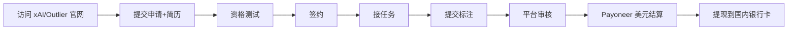

# xAI / Outlier 中文 AI 训练师 远程兼职(2026,时薪 35-45 美元)

## 一句话定位

> 中文母语者向 **xAI(马斯克旗下,Grok 团队)**、**Outlier(Scale AI 子品牌)**、**DataAnnotation** 等美国 AI 实验室申请「AI Tutor / Data Annotator」远程兼职岗,中文音频/文本/推理任务,时薪 **$22.5-45**(¥150-304),通过 Payoneer / Wise / 银行电汇结汇入境。

## 背景与需求(2026 真实证据)

- **xAI 2026-06-01 招聘信息**(已确认):
  - 岗位:AI Tutor - Chinese(Multilingual Audio)
  - 工作内容:训练 Grok 中文语音识别/理解,标注语音、纠错、生成对话
  - 时薪:**$35-45**(¥237-304)
  - 形式:远程 / 全职 / 兼职 / 合同制
  - 申请入口:`https://job-boards.greenhouse.io/xai/jobs/5090180007`
  - 注意:招聘页面要求"不可同时为 xAI 竞争公司工作"
- **Outlier(Scale AI 子品牌)2024-2026 持续招聘**:
  - 岗位:中文 AI 训练师(繁简均可)
  - 时薪:**$22.5-30+**("平均薪资 $22.5/小时",专业能力强者更高)
  - 平台:Outlier.ai
  - 来源:端传媒 2024.12 调查报道 + Reddit r/remotework 2024-2026 持续讨论
- **DataAnnotation.tech**:
  - 岗位:中文 AI 训练师(写作/事实核查/双语训练)
  - 时薪:**$20-40**
  - 门槛:通过资格测试(英语阅读 + 写作能力)
- **Clickworker / Toloka**:入门级数据标注,任务波动大,新手试水

## 自动化路径

工具栈:
- 平台官网:`x.ai/careers/open-roles`、`outlier.ai`、`dataannotation.tech`、`clickworker.com`
- 资格测试:平台在线测评(英语/写作/逻辑)
- 收款:Payoneer(派安盈) / Wise / Deel / 银行电汇 → 支付宝/微信/银行卡
- 任务管理:平台内置 Web 控制台

关键步骤:

| # | 步骤 | 自动/人工 | 工具 |
| --- | --- | --- | --- |
| 1 | 访问平台申请 | 自动 | 浏览器 |
| 2 | 简历投递 | 人工 | Greenhouse / Outlier 平台 |
| 3 | 资格测试 | 人工(监考) | 平台在线测评 |
| 4 | 签约 | 人工 | 平台合同(电子签) |
| 5 | 接任务 | 半自动 | 平台任务池 |
| 6 | 执行标注 | 人工(主要) | 平台控制台 |
| 7 | 平台质量审核 | 自动+人工 | 平台质检 AI + 人工抽审 |
| 8 | 美元结算(T+7 ~ T+30) | 自动 | Payoneer |
| 9 | 提现到国内 | 半自动 | Payoneer → 银行卡(1-2% 费率) |

`auto_ratio`: 0.4(任务执行主要是人工,平台匹配和结算部分自动)

## 评分明细(按 002 标准)

| 维度 | 分数(0-10) | v2 权重 | 加权 |
| --- | --- | --- | --- |
| 启动成本(资金) | 10(0 启动) | 0.15 | 1.50 |
| 启动成本(技能) | 6(需英语阅读能力 + 资格考试) | 0.05 | 0.30 |
| 首笔收入速度 | 7(申请 + 测试 1-2 周) | 0.15 | 1.05 |
| 可扩展性 | 6(可同时接 xAI + Outlier + DataAnnotation) | 0.10 | 0.60 |
| 可持续性 | 5(AI 训练师需求持续,单价可能下降) | 0.10 | 0.50 |
| 自动化程度 | 4(任务执行人工为主) | 0.15 | 0.60 |
| 风险 | 6.5(拆分:法律 8 × 0.5 + ToS 5 × 0.3 + 市场 5 × 0.2 = 6.5) | 0.15 | 0.98 |
| 证据强度 | 8(2026.6 官方招聘 + Reddit 亲测) | 0.15 | 1.20 |
| + 现实数据奖励 | +0.3(xAI $35-45/h 官方,Outlier $22.5/h) | — | +0.30 |
| **总分** | — | — | **7.0** |

决策:**排队**(2026 Q2 热门,值得 1-2 周集中申请 3-4 个平台,跑通一个闭环)

## 启动清单

- [ ] 准备英文简历(强调语言/写作/教学经验)
- [ ] 注册 xAI 申请通道(`https://job-boards.greenhouse.io/xai/jobs/5090180007`)
- [ ] 注册 Outlier 申请通道(`outlier.ai`)
- [ ] 注册 DataAnnotation 申请通道(`dataannotation.tech`)
- [ ] 注册 Clickworker(试水级,验证流程)
- [ ] 准备英语/写作能力证明(通过资格测试)
- [ ] 注册 Payoneer(中国大陆个人可注册,5 万美元/年结汇额度内零成本)
- [ ] 第一周先做 1-2 个任务,验证收款通道
- [ ] 跑通后,集中精力做 xAI / Outlier 高单价任务
- [ ] (推荐)同步考 [AI 训练师国家职业资格](ai-trainer-certificate-cn-2026.md),持证后单价更高

## 风险与红线

- **风险 1:平台 ToS 限制**:
  - 部分平台要求"非 xAI 竞争公司雇员"
  - 任务质量不达标会扣分、封号
  - 缓解:不要同时在 2 个竞争平台接同类任务
- **风险 2:中国 IP / 银行收款**:
  - xAI 等美国公司走 Payoneer/Wise,大陆身份证可注册 Payoneer
  - 5 万美元/年结汇额度内零成本
  - 超过需提供劳务合同(可找代征代缴渠道,见 README 收款通道速查)
- **风险 3:任务波动**:
  - AI 训练师项目有"训练季"和"淡季"
  - 缓解:同时挂 2-3 个平台,分散风险
- **风险 4:单价下降**:
  - AI 训练师单价 $22-45 处于 2024-2026 顶部,未来 1-2 年可能下降
  - 缓解:尽快进入,持续提升专业能力(写作/事实核查/教学经验)
- **风险 5:税务**:
  - 海外平台收入属于"劳务报酬",自行申报个人所得税
  - 5 万美元/年结汇额度 = ~36 万人民币,大部分人达不到起征点
  - 缓解:保留平台收入证明,年度个税 APP 自助申报

## 监控指标

- 指标 1:申请 14 天内拿到至少 1 个平台 offer(目标)
- 指标 2:首月收入 ≥$200(目标:~$10-15/小时 × 15-20 小时)
- 指标 3:月稳定收入 ≥$1500(目标:第 3 个月起)
- 指标 4:任务质量分 ≥4.0/5.0(目标:平台质检通过率)

## 配套机会(同方向已落档)

- [AI 训练师国家职业资格 + 广东补贴](ai-trainer-certificate-cn-2026.md) — 持证后单价更高,且可拿广东政府补贴
- [Lemon Squeezy / Paddle 收款桥梁](lemon-squeezy-mor-china-bridge-2026.md) — 海外收款基础设施
- [AI 卖课(国内向)](ai-course-cn-micro-tutor.md) — 经验积累后可开「AI 训练师上岸指南」课

## 参考来源

1. https://job-boards.greenhouse.io/xai/jobs/5090180007 — 类型:`official` — 抓取:`2026-06-04`
   > xAI AI Tutor - Chinese,Multilingual Audio,$35-45/hour,Remote
2. https://www.moomoo.com/hans/news/post/70870920 — 类型:`media` — 抓取:`2026-06-04`
   > 马斯克旗下 xAI 招聘中文 AI 训练师:远程可兼职,时薪最高 304 元(2026-06-01 TechWeb)
3. https://theinitium.com/20241211-the-techsmith-the-ghost-workers-behind-ai-training/ — 类型:`media` — 抓取:`2026-06-04`
   > Outlier 寻找繁简中文流利作家,$22.5/小时,远程弹性工时
4. https://zhuanlan.zhihu.com/p/2022617306346341109 — 类型:`community` — 抓取:`2026-06-04`
   > 国外数据标注兼职能做吗?Clickworker / Toloka / Scale AI / Outlier / DataAnnotation 7 类平台对比
5. https://www.reddit.com/r/remotework/comments/19fkr65/ai_training_legit_jobs/?tl=zh-hans — 类型:`community` — 抓取:`2026-06-04`
   > AI Training 真实兼职讨论,时薪 $25+

## 复盘/亲测

> 待申请后填写
