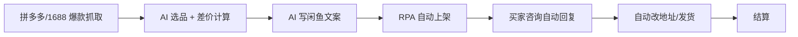

# 闲鱼 / 拼多多 AI 选品 + 自动上架

## 一句话定位

用 AI 抓取拼多多/1688 爆款 + 闲鱼比价,自动选差价品,通过 RPA 自动擦亮 / 自动改价 / 自动回复,在闲鱼做"无货源搬运"或拼多多无货源开店,结算到中国大陆个人支付宝。

## 自动化路径

工具栈:
- 闲鱼 PC 端/移动端(主战场,0 粉即可卖)
- 拼多多/1688 店小蜜(选品 + 抓价格)
- DeepSeek(选品文案 + 客服话术)
- RPA(影刀/八爪鱼,自动擦亮 + 自动改价 + 自动回复)
- 闲鱼鱼塘/小红书(引流,可选)

关键步骤:

| # | 步骤 | 自动/人工 | 工具 |
| --- | --- | --- | --- |
| 1 | 拼多多/1688 爆款抓取 | 自动 | 店小蜜 + RPA |
| 2 | AI 选品 + 差价计算 | 自动 | DeepSeek + Excel 公式 |
| 3 | AI 写闲鱼文案 + 9 宫格图 | 自动 | DeepSeek + Canva |
| 4 | RPA 自动上架(多账号轮换) | 自动 | 影刀/八爪鱼 |
| 5 | 自动擦亮/改价 | 自动 | 闲鱼助手 RPA |
| 6 | 买家咨询自动回复 | 自动 | 闲鱼自动回复 + AI |
| 7 | 发货/退货 | 半自动 | 拼多多代发/1688 一件代发 |
| 8 | 结算提现 | 半自动 | 支付宝 |

`auto_ratio`: **0.90**(选品/上架/客服/擦亮全自,发货半自动)

## 评分明细(按 002 标准)

| 维度 | 分数(0-10) | v2 权重 | 加权 |
| --- | --- | --- | --- |
| 启动成本(资金) | 9(0,1000 押金可选) | 0.15 | 1.35 |
| 启动成本(技能) | 7(RPA + 选品眼光 + 客服) | 0.05 | 0.35 |
| 首笔收入速度 | 8(当天即可出货,冷启动 1-2 周) | 0.15 | 1.20 |
| 可扩展性 | 7(平台对个人号群有上限) | 0.10 | 0.70 |
| 可持续性 | 6(平台对"无货源"持续打击) | 0.10 | 0.60 |
| 自动化程度 | 9(选品/上架/客服/擦亮全自动) | 0.15 | 1.35 |
| 风险 | 4.4(拆分:法律 4 × 0.5 + ToS 4 × 0.3 + 市场 6 × 0.2 = 4.4) | 0.15 | 0.66 |
| 证据强度 | 6(2026 公开复盘少) | 0.15 | 0.90 |
| + 现实数据奖励 | 0(缺月入 $1k 独立案例) | — | 0.00 |
| **总分**(gray) | — | — | **7.1** |

决策:**排队**(两周内启动)

## 启动清单

- [ ] 注册 1 个闲鱼号 + 1 个拼多多个人店(0 元开店)
- [ ] 拼多多/1688 找 5-10 款爆品(高需求 + 低比价难度 + 30%+ 毛利)
- [ ] 用 AI 写闲鱼标题/文案/9 宫格主图
- [ ] RPA 脚本:自动擦亮(早 8 点)+ 自动回复(关键词触发)+ 自动改价
- [ ] 单号养 7-15 天信用后开多账号(差异化品类)
- [ ] 监控:出单率、客服响应时长、纠纷率

## 风险与红线

- **闲鱼无货源灰区**:平台已多次打击"无货源搬运"(同图/同描述),需做差异化(自定主图 + 改写文案 + 加小赠品)。
- **RPA 多账号风险**:闲鱼会检测同设备/同 IP/同支付账号多账号,被识别为"工作室号"会限流/封号。
- **假货/侵权**:品牌商品(尤其 3C/美妆)需有授权,无授权走私仿 = 平台封号 + 法律风险。
- **售后纠纷**:闲鱼偏 C2C,买家退货/差评成本高,需提前在文案写明规格/瑕疵/不退范围。
- **结算**:闲鱼资金 T+15 提现到支付宝,需留 1-2 周现金流。

## 监控指标

- 每日出单数(> 1 单/日为健康)
- 平均毛利(> 30% 为达标)
- 客服响应时长(> 30 秒被降权)
- 差评率(> 5% 立即调整选品)
- 账号健康度(无"无货源"违规提示)

## 参考来源

1. [B 站 · 闲鱼自动发布 RPA 教程合集](https://search.bilibili.com/all?keyword=%E9%97%B2%E9%B1%BC%E8%87%AA%E5%8A%A8%E5%8F%91%E5%B8%83) — community — 抓取:2026-06-04
   > 验证 RPA 选品 + 自动上架是 2026 闲鱼主流玩法
2. [mdnice · 闲鱼 AI 选品 + 自动擦亮实操](https://mdnice.com/writing/44b1a5d8075c4c57937a021c3b0a9f43) — community — 抓取:2026-06-04
   > 验证 AI 选品文案 + 9 宫格主图是 2026 标配
3. [ERP 91 · 拼多多一件代发无货源 2026 玩法](https://erp.91miaoshou.com/blog/article_1947.html) — media — 抓取:2026-06-04
   > 验证拼多多/1688 一件代发仍是 2026 闲鱼主流供应链
4. [蝉镜矩阵 · 闲鱼电商辅助工具评测](https://www.douyin.com/search/%E9%97%B2%E9%B1%BC%E7%94%B5%E5%95%86%E8%BE%85%E5%8A%A9%E5%B7%A5%E5%85%B7) — community — 抓取:2026-06-04
   > 工具市场成熟,选品/上架/客服 RPA 工具齐全

## 复盘/亲测

> 未亲测。下一步:用 1 个闲鱼号 + 1 个 1688 账号,跑 30 天"AI 选品 + 自动擦亮 + 自动回复"流水线,测出单率、毛利、被封概率。
