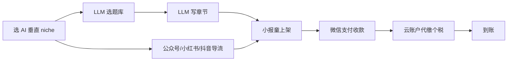

# 小报童 / 知识星球 AI 数字专栏

## 一句话定位

中国个人创作者在小报童(xiaobot.net)或知识星球上开 AI 主题数字专栏(AI 工具测评、Prompt 库、AI 副业案例、AI 跨境赚钱、Cursor 提效脚本等),微信支付收款,平台 15% 抽成,云账户代缴个税,买断价 ¥9-299、订阅价 ¥9-99/月,内容由 LLM 流水线生成,0 启动资金。

## 自动化路径

工具栈:
- 小报童专栏后台(0 资金、微信支付收款、个人即可开通)
- LLM 流水线(选 niche → 大纲 → 章节 → 配图)
- 微信公众号/小红书/抖音(冷启动导流)
- 飞书多维表 / Notion(选题库)
- Coze / Dify(批量内容生产 + 排版)

| # | 步骤 | 自动/人工 | 工具 |
| --- | --- | --- | --- |
| 1 | 选 AI 垂直 niche | 人工 | 小报童排行榜 + 知乎/V2EX |
| 2 | 选题库 | 自动 | LLM + 关键词监控 |
| 3 | 写章节内容 | 自动 | LLM(Claude/GPT) |
| 4 | 配图 | 自动 | Midjourney/即梦/可灵 |
| 5 | 小报童上架 | 半自动 | 小报童后台 + 微信扫码 |
| 6 | 公众号/小红书导流 | 半自动 | 公众号助手 + AI 排版 |
| 7 | 客服/读者服务 | 半自动 | 小报童后台 + 微信群 |
| 8 | 提现 | 半自动 | 钱包 → 云账户 → 银行卡 |

`auto_ratio`: **0.85**(选题+写作+配图+发布均可 AI;唯一人工是开通和读者互动)

## 评分明细(按 002 v2.0 标准)

| 维度 | 分数 | 权重 | 加权 |
| --- | --- | --- | --- |
| 启动成本(资金) | 10(0 资金) | 0.15 | 1.50 |
| 启动成本(技能) | 8(LLM + 基本运营) | 0.05 | 0.40 |
| 首笔收入速度 | 8(2-4 周,微信生态有现成流量) | 0.15 | 1.20 |
| 可扩展性 | 9(同一份内容可同时开多专栏、多平台分销) | 0.10 | 0.90 |
| 可持续性 | 8(微信生态 5-10 年生命周期) | 0.10 | 0.80 |
| 自动化程度 | 8(选题-写作-配图-发布全流水线) | 0.15 | 1.20 |
| 风险 = 0.5×法律 10 + 0.3×ToS 8 + 0.2×市场 5 = **8.4**(normal 标签+15% 抽成+同质化) | 8.4 | 0.15 | 1.26 |
| 证据强度 | 7(真实排行榜数据 + 16,446 读者案例 + #1 周收入 ¥17,640) | 0.15 | 1.05 |
| **加权小计** | — | — | **8.31** |
| + 现实数据奖励:多个独立收入案例(AI 海外赚钱 16,446 订阅、100 个 ML 模型 3,635 订阅、#1 周入 ¥17,640) | — | — | **+0.50** |
| **总分** | — | — | **8.80** |

> **v2.0 重新评分后**:因 16,446 订阅 + #1 周入 ¥17,640 真实排行数据,现实数据奖励 +0.50,新分 8.80。

决策:**排队**(两周内启动,与已落档的 Gumroad 数字商品互为补充)

## 启动清单

- [ ] 选 1 个 AI 垂直 niche(eg: 「AI 海外赚钱」「Cursor 提效脚本」「小报童 prompt 库」「AI 公众号爆款公式」)
- [ ] 找 3-5 个对标专栏(看其定价、内容深度、订阅量)
- [ ] 用 LLM 写前 5 篇(每篇 1500-3000 字,带案例和 Prompt 模板)
- [ ] 配图(Midjourney/即梦/可灵)
- [ ] 小报童申请专栏(微信扫码 + 实名)
- [ ] 定价:买断 ¥19-99 / 订阅 ¥9-19/月
- [ ] 在公众号/小红书/V2EX 创造节点发软文
- [ ] 启动分销合伙人计划(30% 现金返现,小报童内置)
- [ ] 持续更新:订阅制每周 1-2 篇,买断制一次性交付 + 后续小更新

## 风险与红线

- **平台抽成 + 个税**:合计 ~20-25%。需把定价算到位(成本覆盖)。
- **合规边界**:
  - **不写**"AI 一键赚钱""日入过万"等绝对化宣传,触发《广告法》。
  - 涉及 AI 工具推荐时**必须实测**,不能纯 AI 写"用 ChatGPT 一夜暴富"。
  - 涉及股票/币/出海收款等,**加免责声明**(本专栏非投资建议)。
- **内容真实性**:小报童有审核机制(见 `help.xiaobot.net/regulation.html`),纯 AI 生成且无原创观点的,可能被降权。
- **读者投诉**:微信支付可在 24 小时内退款,内容质量必须够硬,否则退款率 > 15% 会影响排名。
- **同质化**:AI 类专栏在小报童已存在多个头部(AI 海外赚钱 16,446 订阅;100 个机器学习模型 3,635 订阅),需垂直差异化。
- **平台政策**:小报童 2026 内容公约明确禁止"虚假宣传、夸大收益、纯营销内容",AI 生成内容需明确标注。

## 监控指标

- 周新增订阅(健康线 > 10)
- 月活读数(健康线 > 30%)
- 退款率(健康线 < 10%)
- 重复订阅率(健康线 > 5%)
- 内容更新频率(订阅制必须 ≥ 1 篇/周)
- 净到手金额(扣除 15% 平台 + 6% 云账户 + 个税后)

## 参考来源

1. [小报童官方](https://xiaobot.net/) — official — 抓取:2026-06-04
   > 创作者中心,买断制 + 订阅制,微信支付 + 邮件投递,浙 B2-20220425 增值电信业务许可
2. [小报童提现及服务费](https://help.xiaobot.net/withdraw.html) — official — 抓取:2026-06-04
   > 平台服务费 15%,云账户代缴个税约 6%,提现至个人/企业两种路径
3. [小报童排行榜 7 天销量榜](https://xiaobaoto.com/ranking/) — community — 抓取:2026-06-04
   > #1 「从素人到百万大V」7天新增 105 订阅,周收入 ¥17,640;#2「100 个超强机器学习模型」周新增 40
4. [小报童精选 - AI 海外赚钱专栏](https://xiaobaoto.com/project/mediabuy/) — community — 抓取:2026-06-04
   > 16,446 读者,374 内容,买断制,2026-05-23 仍在更新,作者「静水流深」
5. [小报童精选 - 提示词工程分类](https://xiaobt.net/prompt) — community — 抓取:2026-06-04
   > AI/前沿、提示词工程、AI 绘画、编程开发四个子分类,均有 100+ 订阅的成熟专栏

## 复盘/亲测

> 未亲测。建议作为 Gumroad 数字商品(已落档 8.4 分)的「中国本土备份渠道」启动:
> - 把同一个 AI 数字商品(Prompt 库 / 工具测评)同时上 Gumroad(美元被动) + 小报童(人民币现金流)
> - 内容 1 份,两份收入
> - 收款通道:Gumroad 用 Stripe/PayPal;小报童用微信支付
> - 自动化栈可在两个平台间复用
