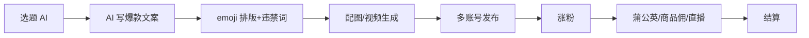

# 小红书 AI 矩阵 + 蒲公英商单

## 一句话定位

个人用 AI 文案 + 排版 + 违禁词检测工具(如 Reditor)批量产出小红书笔记,养 1k-1w 粉账号矩阵 → 接入蒲公英平台接品牌商单 / 商品佣分成 / 直播带货分账,结算到中国大陆个人支付宝/微信。

## 自动化路径

工具栈:
- Reditor / 小红书编辑器(AI 文案 + 违禁词 + emoji 排版)
- DeepSeek/Kimi(小红书爆款仿写)
- 即梦 AI / 可灵(2 分钟以上视频笔记生成,2026 流量突破口)
- 蒲公英(小红书官方品牌合作平台)
- 自动发布(多浏览器插件 / 移动端 RPA)

关键步骤:

| # | 步骤 | 自动/人工 | 工具 |
| --- | --- | --- | --- |
| 1 | 选题(热点+赛道) | 半自动 | 千瓜/蝉妈妈 + AI |
| 2 | AI 写"人感"笔记(口语+emoji) | 自动 | Reditor + DeepSeek |
| 3 | 排版+违禁词检测 | 自动 | Reditor |
| 4 | 配图/视频生成 | 自动 | 即梦/可灵 |
| 5 | 多账号发布 | 半自动 | 移动端 RPA |
| 6 | 涨粉/互动 | 半人工 | 评论引导 + 主动互动 |
| 7 | 接入蒲公英 | 人工一次 | 1000 粉门槛 |
| 8 | 接商单/带货 | 半自动 | 蒲公英平台 |

`auto_ratio`: **0.85**(互动和选品偏人工)

## 评分明细(按 002 标准)

| 维度 | 分数(0-10) | v2 权重 | 加权 |
| --- | --- | --- | --- |
| 启动成本(资金) | 9(0 资金,多账号需手机) | 0.15 | 1.35 |
| 启动成本(技能) | 8(AI 写 + 选题 + 排版) | 0.05 | 0.40 |
| 首笔收入速度 | 7(到 1k 粉接商单需 1-2 月) | 0.15 | 1.05 |
| 可扩展性 | 8(多账号 + 多垂类) | 0.10 | 0.80 |
| 可持续性 | 6(平台对 AI 矩阵内容监管收紧) | 0.10 | 0.60 |
| 自动化程度 | 8(写/排/发全自) | 0.15 | 1.20 |
| 风险 | 4.4(拆分:法律 4 × 0.5 + ToS 4 × 0.3 + 市场 6 × 0.2 = 4.4) | 0.15 | 0.66 |
| 证据强度 | 7(Reditor 2026 教程 + 多家媒体复盘) | 0.15 | 1.05 |
| + 现实数据奖励 | 0(缺月入 $1k 真实案例) | — | 0.00 |
| **总分**(gray) | — | — | **7.1** |

决策:**排队**(两周内启动)

## 启动清单

- [ ] 选 1 个低门槛垂类(美妆/穿搭/家居/母婴/AI 工具测评)
- [ ] 用 Reditor + DeepSeek 仿写 20 篇爆款,测通过率
- [ ] 注册 3-5 个矩阵账号(不同手机/邮箱,差异化定位)
- [ ] 建立"AI 选题 → 写 → 排 → 配图 → 发布"流水线,日更 5-10 条
- [ ] 涨到 1k 粉后申请蒲公英
- [ ] 同步开通小红书店铺,接入商品佣

## 风险与红线

- **平台对 AI 矩阵内容的监管**:2026 小红书已多次打击"AI 批量低质内容",笔记内容必须做"人感"包装(口语化、个人体验、配真人图)。
- **矩阵号关联风险**:同 WiFi/同手机/同 IP 多账号会被识别为"低质矩阵",需差异化(不同内容 + 不同发布节奏 + 不同手机)。
- **蒲公英接广合规**:不能接无品牌资质的商品,医疗/金融类商品有资质门槛。
- **小红书违禁词库**:平台独立违禁词库,需每次发布前过 Reditor。
- **结算**:商单/佣分成结算到支付宝/微信,单笔满 100 元起,主体需实名。

## 监控指标

- 单笔记曝光量(> 1k 为正常)
- 涨粉效率(> 50 粉/日为健康)
- 蒲公英接单率(> 1 单/月/号)
- 账号健康度(无违规提醒,无流量骤降)

## 参考来源

1. [Reditor · 小红书 AI 爆款赚钱笔记:2026 年用 AI 批量产出高赞笔记(2026-02-17)](https://help.reditorapp.com/content/260218%E5%B0%8F%E7%BA%A2%E4%B9%A6ai%E7%88%86%E6%AC%BE%E8%B5%9A%E9%92%B1%E7%AC%94%E8%AE%B0.html) — first-hand — 抓取:2026-06-04
   > "2026 年小红书 AI 赚钱的三条核心路径:AI 选题 → AI 写爆款文案 → emoji 排版 → 违禁词检测"
2. [知乎 · 2026 年小红书获客真相:这套"人感"矩阵策略](https://zhuanlan.zhihu.com/p/2004277093874299746) — community — 抓取:2026-06-04
   > 验证"人感"包装是 2026 小红书矩阵的存活关键
3. [新榜 · 小红书蒲公英 10 月月报](https://data.newrank.cn/article/article-detail/196ccc93201a461b) — first-hand — 抓取:2026-06-04
   > 验证蒲公英平台持续运营,商单生态健康
4. [B 站 · 小红书矩阵基建起号全攻略(2026)](https://www.bilibili.com/video/BV15m4y1v7eg/) — community — 抓取:2026-06-04
   > 2026 实操教程,验证"差异化矩阵"是 2026 主线玩法

## 复盘/亲测

> 未亲测。下一步:用 1 个账号 + Reditor 跑 30 天日更,测"AI 写 + 人感包装"对曝光/涨粉的边际收益,确认后再扩到 3-5 个矩阵号。
