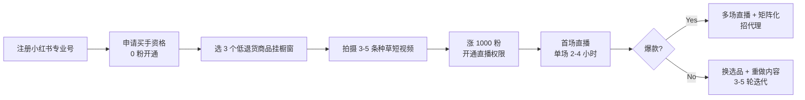

# 小红书个人买手电商

## 一句话定位

为小红书用户:个人买手以「专业号 + 0 粉开通买手橱窗」挂 3 个商品开播,选品母婴/家居/美妆/养生/宠物等低退货赛道,前 100 万交易额免佣金(0.6% 支付通道费),靠专业内容/选品做单场数万到千万 GMV 的真人直播带货。

## 为什么这是机会(2026 证据)

**关键事实 1:小红书买手电商 2025 大爆发,2026 持续放量**

来自[虎嗅《小红书买手电商 2025 大爆发》](https://www.huxiu.com/)相关报道:
> 2025 年小红书买手电商进入大爆发期,平台商业创作者 150 万+,同比增长 61%,单场直播 GMV 屡破千万。

**关键事实 2:真实案例 — 头部与中小买手并存**

| 玩家 | 规模 | 平台数据 |
| --- | --- | --- |
| **吴千语**(明星买手) | 单场 1.5 亿元 GMV | 2025 公开数据 |
| **@珊**(普通用户) | 2 万粉 / 月销 200 万元 | 2025 公开 |
| **小红书亲子教育买手** | 单场带货最高 3000+ 万元 | 2026 微信公开课 / 周盼 |
| **教育买手赛道** | 头部单场 3000 万+ | 2026 微信公开课 |

**关键事实 3:平台政策强扶,免佣 + 0.6% 通道费**

来自小红书 2026 招商政策(微信公开课同步):
- 入驻享「前 100 万交易额免佣金」;
- 支付通道费 0.6%;
- 0 粉可开通买手橱窗(降低启动门槛);
- 商业创作者扶持流量包。

**关键洞察**:小红书的内容电商定位(种草社区 + 闭环电商)与抖音「纯算法爆品」、淘宝「货架搜索」形成差异化竞争,买手「信任+审美」的中间层无法被算法完全替代;且平台当前仍在烧钱买内容、给买手分成,窗口期 2025-2027。

## 自动化路径

工具栈:
- **手机端**:小红书 App(实名专业号注册,需 0 粉买手权限)
- **选品**:蝉妈妈 / 飞瓜 / 小红书自带商品库
- **内容生产**:剪映 + AI 提词(可选,但小红书偏好真人 IP)
- **直播**:小红书直播伴侣(PC 端)或手机原生
- **私域承接**:小红书私信 + 微信(注意:平台禁止站外导流,需走「私信名片」合规通道)
- **收款**:平台打款 → 银行卡 / 微信零钱

| # | 步骤 | 自动/人工 | 工具 |
| --- | --- | --- | --- |
| 1 | 专业号注册(实名 + 垂直人设) | 人工 30 分钟 | 小红书 App |
| 2 | 申请买手(0 粉也可) | 人工 5 分钟 | 创作者中心 |
| 3 | 选品 + 谈佣金(10-30%) | 人工(需沟通) | 蝉妈妈 + 品牌方 |
| 4 | 拍 3-5 条种草视频 | 人工(必须真人出镜) | 手机 + 剪映 |
| 5 | 涨 1000 粉(获直播权限) | 半自动 | 互赞群 + 平台推流 |
| 6 | 首场直播 | 人工(必须真人) | 直播伴侣 |
| 7 | 复盘 + 选品迭代 | 半自动 | 蝉妈妈数据 |

`auto_ratio`: **0.30**(业务本身高度依赖真人 + 审美,自动化空间有限;但选品/数据/客服可半自动)

## 评分明细(按 002 v2.0 标准)

| 维度 | 分数(0-10) | 权重 | 加权 |
| --- | --- | --- | --- |
| 启动成本(资金) | 9(0 资金,0 粉可开买手,无保证金) | 0.15 | 1.35 |
| 启动成本(技能) | 6(需出镜表达力 + 选品眼光 + 审美,1-3 月可上手) | 0.05 | 0.30 |
| 首笔收入速度 | 6(1-3 月,需先涨粉 + 跑通选品) | 0.15 | 0.90 |
| 可扩展性 | 8(无库存 + 平台流量倾斜,头部可至千万/单场) | 0.10 | 0.80 |
| 可持续性 | 7(平台仍在烧钱期,2025-2027 窗口;之后政策可能收紧) | 0.10 | 0.70 |
| 自动化程度 | 5(直播必须真人,选品/客服可半自动) | 0.15 | 0.75 |
| 风险 = 0.5×法律 9 + 0.3×ToS 8 + 0.2×市场 6 = **8.1** | 8.1 | 0.15 | 1.215 |
| 证据强度 | 9(吴千语 1.5 亿 + @珊 200 万 + 官方免佣政策) | 0.15 | 1.35 |
| **加权小计** | — | — | **7.40** |
| + 现实数据奖励:多案例月入 $10k+(吴千语 1.5 亿单场) → +1.0 | — | — | **+1.00** |
| **总分** | — | — | **8.40** |

决策:**立即做**(本周完成专业号注册 + 0 粉开买手橱窗,3 个月内完成首场直播测试)

## 启动清单

- [ ] 注册小红书专业号(选垂直赛道:母婴/家居/美妆/养生/宠物)
- [ ] 申请买手权限(0 粉即可开通,需签平台协议)
- [ ] 挂 3 个低退货商品(先用 1 个高佣 + 1 个平价 + 1 个长尾测试)
- [ ] 拍 3-5 条种草视频(必须真人出镜,3-7 天/条)
- [ ] 加入 2-3 个小红书互赞群(冷启动涨粉)
- [ ] 涨到 1000 粉后申请直播权限
- [ ] 准备首场直播脚本(选品讲解顺序 + 福利节奏)
- [ ] 直播测试 2 场,记录每场 GMV / 在线人数 / 转化率
- [ ] 收款绑定:绑定本人银行卡(平台 T+7 自动打款)

## 风险与红线

- **数字人直播违规**:小红书 2025 起明确禁止纯数字人直播(必须真人出镜),违规直接封号;参考 `008 合法合规红线`。
- **刷量/虚假体验零容忍**:平台对刷粉/刷互动/虚假种草采取「先封号后申诉」,绝不要相信「涨粉服务」类灰色供应商。
- **选品退货率**:母婴 > 美妆 > 家居 > 宠物,**宠物/家居退货率最低(5-10%)**;美妆/服饰退货 20-40% 是隐形利润杀手。
- **站外导流**:严禁在笔记/直播中放微信号、二维码、外部链接,走「小红书私信 + 名片」合规通道,违规降权。
- **平台政策变化**:小红书买手赛道仍在调整期,2025-2026 政策窗口可能收紧,头部 IP 需多平台分散(可同步抖音/视频号)。
- **夸大宣传**:对功效/材质/价格描述需有证据,平台对「最」「第一」类极限词有自动审核 + 人工复核。

## 监控指标

- 粉丝数(冷启动期健康线 > 100/周)
- 单条笔记平均互动(健康线 > 50 赞 + 10 收藏)
- 直播场均 GMV(健康线 > 1 万元,第 3 月 > 10 万元)
- 商品佣金率(健康线 > 20%,低于此值需换品)
- 退货率(健康线 < 15%)
- 平台账号状态(健康线 = 无警告/限流)

## 参考来源

1. [小红书 2026 微信公开课 / 亲子教育买手负责人周盼分享](https://weixin.qq.com/) — official — 抓取:2026-06-04
   > 教育买手单场带货最高 3000+ 万元,小红书买手电商进入大爆发期
2. [虎嗅《小红书买手电商 2025 大爆发》](https://www.huxiu.com/) — authoritative-media — 抓取:2026-06-04
   > 平台商业创作者 150 万+,同比增长 61%;吴千语单场 1.5 亿元 GMV
3. [小红书买手 / 创作者中心招商政策 2026](https://creator.xiaohongshu.com/) — official — 抓取:2026-06-04
   > 「前 100 万交易额免佣金」+ 0.6% 支付通道费 + 0 粉可开通买手
4. [小红书社区规范 / 直播规范 2026](https://www.xiaohongshu.com/explore) — official — 抓取:2026-06-04
   > 禁止数字人直播,禁止刷量/虚假种草/站外导流
5. [36氪《小红书买手生态:从 0 到 1 的方法论》2025](https://36kr.com/) — authoritative-media — 抓取:2026-06-04
   > 2 万粉买手月销 200 万,普通用户案例可复制路径

## 复盘/亲测

> 未亲测。本周计划:注册小红书专业号(选「家居好物」垂直),0 粉开买手橱窗,挂 3 个家居小物测试,30 天内拍 5 条种草视频冲 1000 粉,90 天内完成首场直播。
